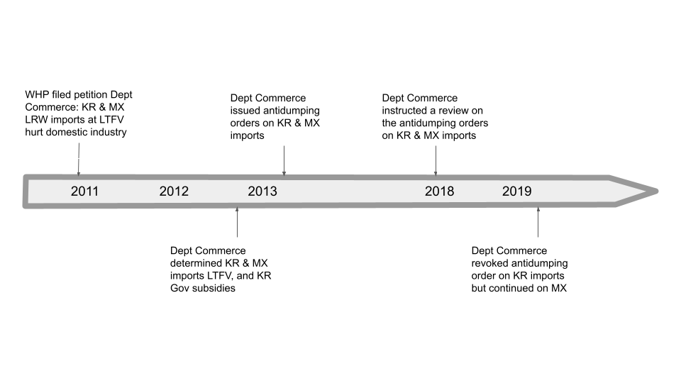

```{r setup, include=FALSE}
options(htmltools.dir.version = FALSE)
knitr::opts_chunk$set(
  fig.width=9, fig.height=3.5, fig.retina=3,
  out.width = "100%",
  cache = FALSE,
  echo = FALSE,
  message = FALSE, 
  warning = FALSE,
  hiline = TRUE
)
```

```{r xaringan-themer, include=FALSE, warning=FALSE}
library(xaringanthemer)
style_duo_accent(
  primary_color = "#4F2683",
  secondary_color = "#4F2683",
  inverse_header_color = "#FFFFFF",
  base_font_size = "30px",
  title_slide_background_image = "Horizontal_Rev.png",
  title_slide_background_size = "5% no-repeat",
  title_slide_background_position = "bottom",
  extra_css = list(
  ".small" = list("font-size" = "80%"),
  ".full-width" = list(
    display = "flex",
    width   = "100%",
    flex    = "1 1 auto"
    )
  ),
  header_font_google = google_font("Merriweather", "400","400i","700"),
  text_font_google   = google_font("Arimo", "400", "400i"),
  code_font_google   = google_font("IBM Plex Mono")
)
```

## Objective

- Summer paper
- Work-in-progress ideas
- Data

---
class: inverse center middle

# Stochastic revealed preferences and market power

---
layout: true
### SRP + Mkt Power

---

- **Question:** Do the observed price and quantities in the oil industry arise as an equilibrium of Cournot competition and quantities are mismeasured?

- **What I do:** I use tools developed by Schnenach (2014) and adapted by Aguiar and Kashaev (2020) to introduce measurement error in Carvajal et al. (2013).

- **What I find:** Ignoring measurement error leads to an over-rejection of the Cournot model.

- **Limitations:** 1) Silent about Market Power 2) Demand 3) Technical issues (iid, power, unobserved real prices)

---

- 3 interesting questions to applied IO researchers:
  1. Counterfactual demand estimates. Intuition: Products with similar characteristics should attract similar buyers.
  1. Recover marginal costs/ markups
  1. How much is driven by parametric assumptions?

- What's next?
  1. Reformulate using profit function
  1. Bertrand and product differentiation
  1. Define Market and find data (RTE Cereal, airplane trips, yogurts, detergents)
  
---
layout: false
class: inverse center middle

# Aggressive entry, prices and productivity

---

### Aggressive entry, prices and productivity


* Standard economic theory:
  * $p_{it}-mc_{i}(\omega_i)\ge0$, 
  * $\implies$ most productive firm, lowest price 
  * $\implies$ market shares inform about firms' productivity and markups.

* Firms might forgo **today's** profits if the cost of recovering market shares **tomorrow** is greater than immediate losses.

* Case of study: Whirlpool vs LG (US international trade commission) .small[(Flaaen et al., _AER_ 2020 )]


---

```{r, eval=T,  include=TRUE, fig.align='center'}

```


<!--  -->
---
### Aggressive entry, prices and productivity

* **Questions**: How do incumbent firms form beliefs about the productivity of new competing firms .small[(Aguirregabiria and Jeon, _Rev.Ind.Organ._ 2020)]? How do firms react against aggressive entry? 

* **Data**: Nielsen .small[Flaaen et al.(_AER_ 2020 ) Gap Intelligence + Traqline Market Research]

* **Method**: Structural dynamic model with beliefs 

---
layout: false
class: inverse center middle

# Immigrant job market and productivity losses in Canada

---
layout: true

### IJB + productivity losses

---

* Immigrants are key for the economic development of Canada by filling in the gaps in the labor market. By 2036, 30% of pop. .small[(Mortency et al., 2017)]

* However, immigrants suffer unemployment and underemployment .small[(Adamuti-Trache, 2016)], and face multiple frictions (financial, signaling, networks).

* Furthermore, employers do not actively recruit immigrants, can't assess foreign credentials, don't assess immigrants competencies, have a preference for Canadian experience and domestic candidates .small[(Chhinzer and Oh, 2021)]. Firm side remains understudied. 

---

* **Question**: Frictions in the Canadian job market for immigrants (TFW and SIE) and for employers negatively affect firms' productivity. How big? Can we measure them?

* **Data**: StatsCan + IRCC linked databases

* **Approach**: 
  1. Search model to calibrate frictions and recover counterfactual matches.
  2. 2SGMM procedure for Production function + productivity monotonic in immigrant skills.


---
layout: false
class: inverse center middle

# Tax evasion and productivity in Mexico

---
layout: true

### Tax evasion and productivity

---

* Firms have incentives to under-report profits to avoid taxes. Productivity estimates are likely to be biased.

* Mexico: Non-detected tax evasion up to $10 billion USD per year .small[(Zumaya et al., 2021)]

* Centering/location condition by incentive constraint? .small[(Hu and Schennach, 2008)].

\begin{align}
  y&=f(x^*,\omega) \\
  x&=x^*+\Delta x(s) \\
  \Delta x(s) &= \left \{ \begin{array}{ll}
    0 & (1-\tau)\Pi(x^*) \ge \Pi(x^*)-\tau\Pi(x)-\kappa Pr(a)-c(\Delta x) \\
    \mathbf R_{++} & otherwise
  \end{array} \right.\\
\end{align}

---

* **Question**: Can we use a micro-founded IC as location condition? $M[f]=x^*$, where $M[f]$:

\begin{equation}
  \sup\left \{ v: \int^{v}_{x^*} \left \{ \tau [\Pi(x^*)-\Pi(x)]-c(x-x^*)\right\} f_{X|X^*}(x|x^*) dx \le\kappa Pr(a)  \right\}
\end{equation}

* **Data**: INEGI-EMIM, Anonymized tax filings (?) .small[(Zumaya et al., 2021)]

* **Approach**: Hu & Schennach (2008), Hu (2021) 


---
layout: false
class: center, middle

# Thanks!

