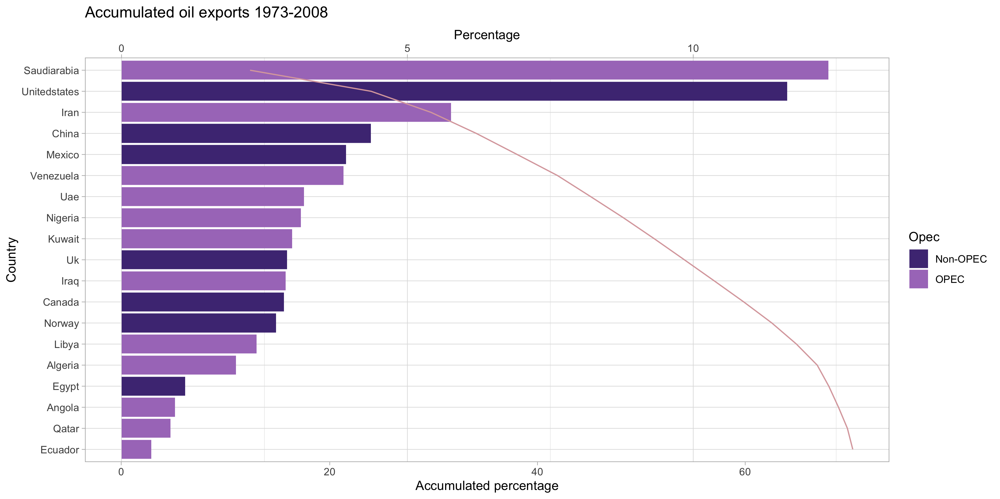
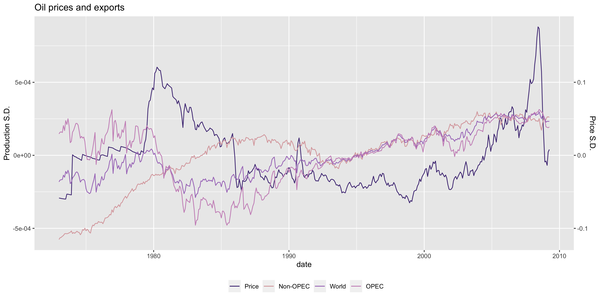

```{r setup, include=FALSE}
options(htmltools.dir.version = FALSE)
knitr::opts_chunk$set(
  fig.width=9, fig.height=3.5, fig.retina=3,
  out.width = "100%",
  cache = FALSE,
  echo = FALSE,
  message = FALSE, 
  warning = FALSE,
  hiline = TRUE
)
```

```{r xaringan-themer, include=FALSE, warning=FALSE}
library(xaringanthemer)
style_duo_accent(
  primary_color = "#4F2683",
  secondary_color = "#4F2683",
  inverse_header_color = "#FFFFFF",
  base_font_size = "30px",
  title_slide_background_image = "Horizontal_Rev.png",
  title_slide_background_size = "5% no-repeat",
  title_slide_background_position = "bottom",
  extra_css = list(
  ".small"      = list("font-size" = "80%", 
                  "color" = "#4F2683"),
  ".full-width" = list(
                  display = "flex",
                  width   = "100%",
                  flex    = "1 1 auto"),
  ".footer" = list("color"    = "#4F2683",
                   "position" = "fixed",
                   "top"      = "95%",
                   "left"     = "0",
                   "text-align"= "left",
                   "width"    = "50%",
                   "font-size"= "80%")),
  header_font_google = google_font("Merriweather", "400","400i","700"),
  text_font_google   = google_font("Arimo", "400", "400i"),
  code_font_google   = google_font("IBM Plex Mono")
)
```

```{r setup2, include=FALSE}
mypath <- "/Volumes/SSD Hans 1/Github/Adv Micro/Market Power/RP_Cournot/RP_Cour/results/Previous"
results_path <- "/Volumes/SSD Hans 1/Github/Adv Micro/Market Power/RP_Cournot/RP_Cour/results"
library(tidyverse)
library(knitr)
library(kableExtra)
library(DT)
```

## Before we start

- Excited to be here!
  - Non-traditional tools for applied IO questions
  - Currently getting two kinds of reactions
      - Nah...
      - Cool, but...            
- Feedback on:
  - Relevance (motivation, big question)
  - Clear question
  - Where does this paper fit into big question
  - How to sell to applied IO practitioners

---
layout: true
## Introduction

---

- Testing firm conduct .small[(competition in pries or quantities, market power)] matters .small[(regulation, consumer welfare)]
- Standard approach 
  - Estimate demand (discrete choice)
  - Given demand, combine with firm competition model
- Assume parametric functional forms and distributions

> Important question: What's the fundamental role of these assumption shaping what we learn from data?

---

- Alternative approach, the Revealed Preference test
- Necessary and sufficient conditions that take the form of a system of inequalities
- Empirically assess the consistency of theoretical models with observational data
- Rely on shape-restrictions, but no parametric assumptions
- However, RP tests are deterministic and could not accommodate ME, until recently.
  - ME is ubiquitous
  - Consumer side: ignoring ME leads to over-rejection of the RP test .small[(Aguiar & Kashaev, 2020)]

---
layout: false

### Where this could go

- Once ME is incorporated into the RP approach, we can invert the test to **derive bounds for latent variables** .small[(Gauthier, 2021)]
  - Could say something about the role of assumptions in parametric approach
- Along the way, **non-parametric test for Market Power**
- Set of tools to study models of firm competition **complementary** to standard methods.

#### This paper
- First step: Shows how to integrate **ME into the RP test** for models of firm competition. 

---

## Overview of this paper

- **What’s the question?**: Do the observed prices and quantities in the oil industry arise as an equilibrium of the Cournot model when quantities are mismeasured?
- **Why does it matter?**: The OPEC cartel has had a quantity adjusting policy since 1985. Given the cartel's relevance, we would think the Cournot model to be a good fit for their behavior. However, the literature has mixed and inconclusive results. 
- **How do I do it?**: I design a stochastic RP test of the Cournot model by introducing ME to Carvajal et al. (.small[*ECTA*, 2013]).
- **What do I find?**: In contrast to the deterministic version of the test. the Cournot hypothesis can no longer be rejected once ME in quantities is introduced. 

---
### Cournot Rationalizability and ME

- Crude oil industry: The Organization of Petroleum Exporters Countries (OPEC) determines at least twice a year at the "Conference" how to adjust its output (since 1985, before they set their price).
  - Production share (2009): 40.9%
  - Reserves: 85% of world total in 2011 .small[(Wirl, 2015)]
  - Reserves-to-production ratio: 90 years 2011 (U.S. 10 years).small[(Wirl, 2015)]
- Prices of all other fuels are linked to the oil price, directly .small[(natural gas contracts in Europe)] or indirectly .small[(supply/demand interactions)] .small[(Wirl, 2015)]
- Mixed and inconclusive results in the literature empirically testing the cartel hypothesis .small[(Griffin, 1985; Griffin and Xiong, 1997; Mason and Polasky, 2005; Smith, 2005; Carvajal et al., 2013; Wirl, 2015; Moghadam, 2021)]

---
### Cournot Rationalizability and ME

- Cournot competition: firms compete in quantities and they produce a single homogeneous good with a downward sloping inverse demand function

- Carvajal et al. (2013) developed a RP test for the Cournot model 
  - Using 1973-2009 prices and production quantities for OPEC and major Non-OPEC oil producers , the authors reject the Cournot Hypothesis
  - In this setting, ME in quantities could arise from: Consolidation process or Coordination mistakes
  - The result can be driven by the omission of ME in their model
    - Intuition: deterministic convex function rationalizing the data

---
name: set
## Setting 

- A set of firms $\mathcal I= \{1,2,..., I\}$ produce a single homogeneous good $q_t = \sum_{i\in\mathcal I}q_{it}$ with a downward slopping inverse demand function $p(q_t)=p_t$ with $p'(q_t) \le 0$.
- The data set $\mathcal O = \{p_t, (q_{it})_{i \in \mathcal I} \}_{t\in \mathcal T}$ consists of $T$ observations indexed by $t\in \mathcal T =\{1,2,...,T\}$ 
- Firms have unobserved convex cost functions and their first derivative at $q_{it}$ is indicated by $\delta_{it}$

.footer[[&#9654; Deterministic test](#det_theo)]

---
### Setting

Let $\mathbf{ p}_t^* \in \mathbf P_t \subseteq \mathbb R_{++}^L$ and $\mathbf{ q}_t^* \in \mathbf Q_t \subseteq \mathbb R_{+}^L \setminus \{0\}$ denote random vectors of true prices and true quantities at time $t$, respectively.

### Measurement Error

*Measurement error*, $\mathbf{w}=(\mathbf{w}_t)_{t\in\mathcal T}\in W$, is the difference between the observed random variables and their true values. 

\begin{equation}
  \mathbf{w}=\left( 
    \begin{array}{c}
      \mathbf{w}^q_t \\
      \mathbf{w}^p_t
    \end{array}
  \right) =
  \left(
    \begin{array}{c}
      \mathbf{q}_t-\mathbf{q}_t^* \\
      \mathbf{p}_t-\mathbf{p}_t^*
      \end{array}
  \right), \quad \forall t \in \mathcal T \notag
\end{equation}


---
name: main_lemma

### Stochastic Cournot Rationalizability

>  **LEMA:** The following statements are equivalent:

>  1. The random array $\{(\mathbf{q}_{it}^*)_{i\in\mathcal I},\mathbf{p}_t^*\}_{t\in\mathcal T}$ is **stochastic Cournot rationalizable (SCR).**

>  2. There exists nonnegative random vectors $(\delta_{it})_{(i,t)\in\mathcal{I\times T}}$ that satisfy:

>  i. $\frac{\mathbf{p}^*_t-\delta_{it}}{\mathbf{q}^*_{it}}=\frac{\mathbf{p}^*_t-\delta_{jt}}{\mathbf{q}^*_{jt}}\ge0$  *(common ratio property)*, and

>  ii. $(\delta_{it}-\delta_{is})(\mathbf{q}^*_{it}-\mathbf{q}^*_{is})\ge0$ *(co-monotone property)*

>  a.s., $\forall t,s\in \mathcal T$, and every $i, j\in \mathcal I$.

.footer[[&#9654; Definition](#SCR_def)]

---
layout: true

### Characterization by moment conditions

---

- We can summarize the empirical content of the SCR by a set of moment conditions. 
- Let $\mathbf e=(\delta,\mathbf{w})'\in E|X$ denote the vector of random latent variables and
- $\mathbf{x}=(\mathbf{q},\mathbf{p})'$ the vector of observed random variables. 
- Moreover, let $\mathcal{P}_X$, $\mathcal{P}_{E,X}$, and $\mathcal{P}_{E|X}$ denote the set of all probability measures defined over the support of $\mathbf{x}, (\mathbf{e},\mathbf{x}), \text{ and } \mathbf{e}|\mathbf{x}$, respectively. 

---
name: mom_cond

Define the following moment conditions:

$$\begin{aligned}
g_M(\mathbf{x},\mathbf{e})&=\mathbf{p}'_{t}\mathbf{w}^q_{t}, \\
g_{R}(\mathbf{x},\mathbf{e})&= \mathbf 1 \left[ \frac{\mathbf{p}_t-\delta_{it}}{\mathbf{q}_{it}-\mathbf{w}^q_{it}}=\frac{\mathbf{p}_t-\delta_{jt}}{\mathbf{q}_{jt}-\mathbf{w}^q_{jt}}\ge0\right]-1, \\
g_{C}(\mathbf{x},\mathbf{e})&= \mathbf 1 \left[(\delta_{it}-\delta_{is})(\mathbf{q}_{it}-\mathbf{w}^q_{it}-\mathbf{q}_{is}+\mathbf{w}^q_{is})\ge0\right]-1,\\
\forall i\not=j \in \mathcal I, t\not=s \in \mathcal T \notag
\end{aligned}$$

.footer[[&#9654; Theorem](#mom_cond_theo)]


---
layout: true
### Using ELVIS 

---
name: elvis_1

- We can solve the problem of having a latent random set of variables $\mathbf e$ with unknown $\mu\in\mathcal P_{E|X}$ using the *Entropic Latent Variable Integration via Simulation* (ELVIS) .small[(Schennach, 2014)]. 
- Intuitively, there might be many possible conditional distributions $\mu\in\mathcal P_{E|X}$ of the latent variables that satisfy the moment conditions. 
- ELVIS ranks them by entropy and selects the *least favourable*, thus, converting an *existence* problem into an optimization problem.

---

- In practice, I used Markov Chain Monte Carlo (MCMC) methods. 
- Intuitively, the RP inequalities define a multidimensional region in the hyperspace. 
- First, we find a point inside the region, then, we move randomly inside the object to integrate out the latent variables.


---
layout: true
### Test statistic

---

\begin{equation}
  TS_n=n \inf_{\gamma\in\mathbb R^q} \hat{\tilde{h}}_M(\gamma)'\hat{\tilde{\Omega}}^{-1}\hat{\tilde{ h}}_M(\gamma)
\end{equation}

where $\hat{\tilde{ h}}_M(\gamma)$ and $\hat{\tilde{\Omega}}$ are the sample analogues of the maximum-entropy moment and its variance, defined as:

\begin{align}
  \hat{\tilde{h}}_M(\gamma)&=\frac{1}{n}\sum_{k=1}^{n}\tilde h_M(\mathbf{x}_k;\gamma) \\
  \hat{\tilde{\Omega}} (\gamma)&=\frac{1}{n}\sum_{k=1}^{n}\tilde h_M(\mathbf{x}_k;\gamma)\tilde h_M(\mathbf{x}_k;\gamma)'-\tilde h_M(\gamma)\tilde h_M(\gamma)'
\end{align}

---

Assuming data $\{\mathbf x_i\}_{k=1}^{n}$ is i.i.d., hence, under the null hypothesis that the data is approximately consistent with SCR, it follows that:

\begin{equation}
  \lim_{n\rightarrow\infty} \mathbb P \left( TS_n > \chi_{q,1-\alpha}^{2} \right)\le\alpha \; \text{ , for every }\alpha \in (0,1) \notag
\end{equation}

---
layout: false
name: data
### Data

- Production quantities data from the *Monthly Energy Review* (MER), published by the U.S. Energy Information Administration, 
- MER provides a series of monthly crude oil production in thousands of barrels per day by 12 OPEC members and 7 nonmembers
- Price series come from the St. Louis Federal Reserve, dollars per barrel.
- The data covers January 1973 to April 2009. A total of 436 obs.


.footer[[&#9654; Data table](#data_table)]

---


---


---

### Results

```{r t1, warning=FALSE, message=FALSE, eval=FALSE}

joint <- readr::read_csv(paste0(mypath,"/1_joint_sem.csv"), na = "", quoted_na = TRUE)
decade <- readr::read_csv(paste0(mypath,"/2_decade_sem.csv"), na = "", quoted_na = TRUE)
t3 <- rbind(joint, decade)
t3$Period <- c("1973-2008", "1973-1980","1981-1990","1991-2000","2001-2008")

t3 <- t3 %>% replace_na(list(stars=""))
kable(t3[,c(4,1,2,3)], digits = c(0, 2,4, 0),
      col.names = c("Period","\\(TS_n\\)","\\(p\\) value",""),
      escape = F, booktabs = T,
      caption = "\\(TS_n\\) statistic and p-values for the six major oil producers") %>% 
  kable_styling() %>% 
  footnote(general="The six producers are Saudi Arabia, U.S.A, Iran, China, Mexico and Venezuela. Countries are assumed to play semiannual independent games.",
           threeparttable = T, escape = F, fixed_small_size = T)
  
```

```{r results_table}
main_results_names <- list(Big6 = c("joint_Big6_10000.csv","decade_Big6_10000.csv"),
     OPEC = c("joint_OPEC_10000.csv","decade_OPEC_10000.csv"),
     NonOPEC = c("joint_NonOPEC_10000.csv","decade_NonOPEC_20000.csv"))

Big6 <- lapply(main_results_names$Big6, function(x){read.csv(paste0(results_path,"/",x))})
OPEC <- lapply(main_results_names$OPEC, function(x){read.csv(paste0(results_path,"/",x))})
NonOPEC <- lapply(main_results_names$NonOPEC, function(x){read.csv(paste0(results_path,"/",x))})

B6_table <- rbind(Big6[[1]],Big6[[2]])
OPEC_table <- rbind(OPEC[[1]],OPEC[[2]])
NOPEC_table <- rbind(NonOPEC[[1]],NonOPEC[[2]])

results_table <- cbind(B6_table[,1:3],OPEC_table[,2:3],NOPEC_table[,2:3])

kbl(results_table) %>% 
  kable_classic() %>% 
  add_header_above(c(" "=1,"Big 6" = 2, "OPEC" = 2, "Non OPEC" = 2))
  
```


---

### Discussion and future work

This paper:
1. MC simulations to check if test has any bite
1. Unobserved price heterogeneity in the oil industry

Future projects:
1. Better demand estimates
1. Bertrand and product differentiation
1. Non-parametric Market Power test
1. Non-parametric bounds for marginal costs and markups
1. Reformulate using profit function


---

### Conclusions

- I develop a stochastic RP test for the Cournot model that accounts for ME. 
- Using data on the major oil-producing countries, I can no longer reject the Cournot hypothesis at the 5 % significance level. 
- More broadly, first setp towards developing a set of tools to study models of firm competition **complementary** to standard methods.

---
layout: false
class: inverse, center, middle
count: false

# END

---
layout: true
count: false


---
name: det_theo
count: false

### Roadmap in the paper

1. Define deterministic RP test
1. Define Stochastic Cournot Rationalizability (SCR) and its corresponding stochastic RP test
1. Introduce ME and centering condition
1. Cast the empirical content of the SCR into a set of moment conditions
1. Redefine SCR in terms of the maximum-entropy moment (MEM) to use ELVIS
1. Define test statistic with the sample analogues of the MEM

---
count: false

### The Cournot RP deterministic test

- Consider an industry consisting with $I$ firms, $\mathcal I= \{1,2,..., I\}$. 
- The data set $\mathcal O$ consists of $T$ observations indexed by $t\in \mathcal T =\{1,2,...,T\}$. 
- The econometrician observes the output of each firm, $q_{it}\in\mathbb R_+$ and the price $p_t\in \mathbb R_{++}$.
- One homogeneous good.
- Firms have convex costs functions that do not vary across observations and 
- Inverse demand is a downward-sloping function.

---
count: false
### THEOREM 1 .small[(Carvajal et al., 2013)]

>  The following statements are equivalent:

>  A. The data set $\mathcal O = \{p_t, (q_{it})_{i \in \mathcal I} \}_{t\in \mathcal T}$ is *Cournot rationalizable* with convex cost functions.

>  B. There exists a set of non-negative numbers $(\delta_{it})_{(i,t)\in\mathcal{I\times T}}$ that satisfy:

>  i. $\frac{p_t-\delta_{it}}{q_{it}}=\frac{p_t-\delta_{jt}}{q_{jt}}\ge0$ *(common ratio property)*, and

>  ii. $(\delta_{it}-\delta_{is})(q_{it}-q_{is})\ge0$ *(co-monotone property)*

>  for every $t,s\in \mathcal T$, and every $i, j\in \mathcal I$.

.footer[[&#9654; Back](#set)]
---
name: SCR_def
count: false

>  **DEF**: A random array $\{(\mathbf{q}_{it}^*)_{i\in\mathcal I},\mathbf{p}_t^*\}_{t\in\mathcal T}$ is **stochastic Cournot rationalizable (SCR)** if there exists a tuple $\left(\mathbf c, (\mathbf{\lambda}_t)_{t\in\mathcal T}\right)$, such that:

>  1. $\mathbf c$ is a random, continuous, and convex cost function;

>  2. $\mathbf{c'}(\mathbf{q}_{it}^*)-\lambda_{t}[\mathbf{q}_{it}^*\nabla \mathbf{p}(\mathbf{q}_{t}^*)+\mathbf{p}(\mathbf{q}_t^*)]\le0$ a.s. for every $i\in\mathcal I$ and every $t\in\mathcal T$;

>  3. $(\lambda_t)_{t\in\mathcal T}$ is a positive random vector supported on or inside a known set $\Delta \subseteq\mathbb R_{++}^{|\mathcal T|}$, $\nabla \mathbf{p}(\mathbf{q}_t^*)$ is a random negative number, and $\mathbf{p}(\mathbf{q}_t^*)=\mathbf{p}_t^*$ for all $t\in\mathcal T$;

>  4. For every $i\in \mathcal I$ and $t\in \mathcal T$, it must be the case that

>  $$\mathbb P\left(\mathbf{q}_{it}^*\not=0, \mathbf{c'}(\mathbf{q}_{it}^*)-\lambda_{t}[\mathbf{q}_{it}^*\nabla \mathbf{p}(\mathbf{q}_{t}^*)+\mathbf{p}(\mathbf{q}_t^*)]<0\right)=0.$$

.footer[[&#9654; Back](#main_lemma)]

---
name: mom_cond_theo
count: false

### Moment conditions theorem

Define $\mathbb E_{\mu\times\pi}[g(\mathbf x, \mathbf e)]=\int_X \int_{E|X} g(x.e)d_\mu d_\pi$, where $\mu\in \mathcal{P}_{E|X}$ and $\pi\in \mathcal{P}_{X}$, and $g(\mathbf{x},\mathbf{e})=(g_M(\mathbf{x},\mathbf{e})',g_R(\mathbf{x},\mathbf{e})',g_{C}(\mathbf{x})')'$.

#### Theorem 
>  A random vector $\mathbf{x}=(\mathbf{p}_t,\mathbf{q}_t)_{t\in\mathcal T}$ is approximately **stochastic Cournot rationalizable (SCR)** iff

> $$\inf_{\mu\in\mathcal P_{E|X}} \|\mathbb E_{\mu\times\pi_0}[g(\mathbf{x},\mathbf{e})] \| =0$$

>  where $\pi_0\in \mathcal P_X$ is the observed distribution of $\mathbf x$.

.footer[[&#9654; Back](#mom_cond)]

---
name: using_elvis
count: false

### Using ELVIS 

1. Define a maximum-entropy moment, $h(x;\gamma)$, as the marginal moment of the function $g$ at which the latent variable has been integrated out. 
1. This maximum-entropy moment requires an arbitrary user-defined distribution $\eta\in \mathcal P_{E|X}$ that needs to comply with certain characteristics, but it does not affect the set of values that $\mathbb E_{\pi_0}[h(\mathbf x;\cdot)]$ can take. 
1. Finally, we can state the necessary and sufficient conditions to be approximately SCR in terms of the maximum-entropy moment, $\tilde h(x;\gamma)$, with distribution $d\tilde \eta(\cdot|x)=\mathbb 1(g_R(x,\cdot)=0)\mathbb 1 (g_C(x,\cdot)=0)d\eta(\cdot|x)$.


---
count: false

### Using ELVIS 

- In practice, we need to use Markov Chain Monte Carlo (MCMC) methods to compute $\tilde h(x;\gamma)$ by sampling from $\eta$ and reject if the draw if it does not satisfy $\mathbb 1(g_R(x,\cdot)=0)\mathbb 1 (g_C(x,\cdot)=0)$. 
- In the application, I used a double hit-and-run algorithm adapted from Aguiar & Kashaev (2020) to sample directly from $\tilde \eta$.

.footer[[&#9654; Back](#elvis_1)]


---
name: data_table

```{r}
load("prod_tab.Rdata")
prod_tab$perc <- prod_tab$perc/100

DT::datatable(prod_tab, 
              colnames = c("Country", "Total","Annual Avg.","%","OPEC")) %>% 
  formatPercentage('perc',1) %>% 
  formatRound(c('annual_avg','total'),1)


```

.footer[[&#9654; Back](#data)]

---