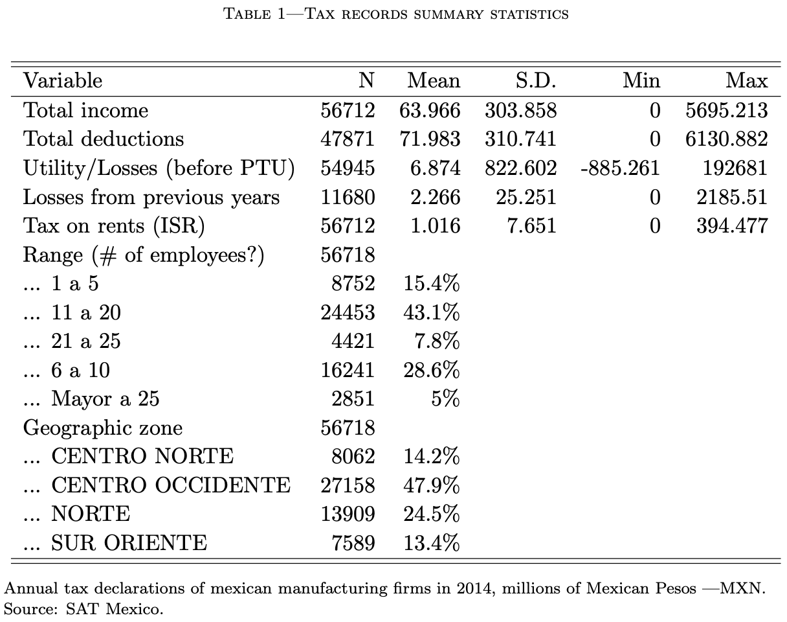
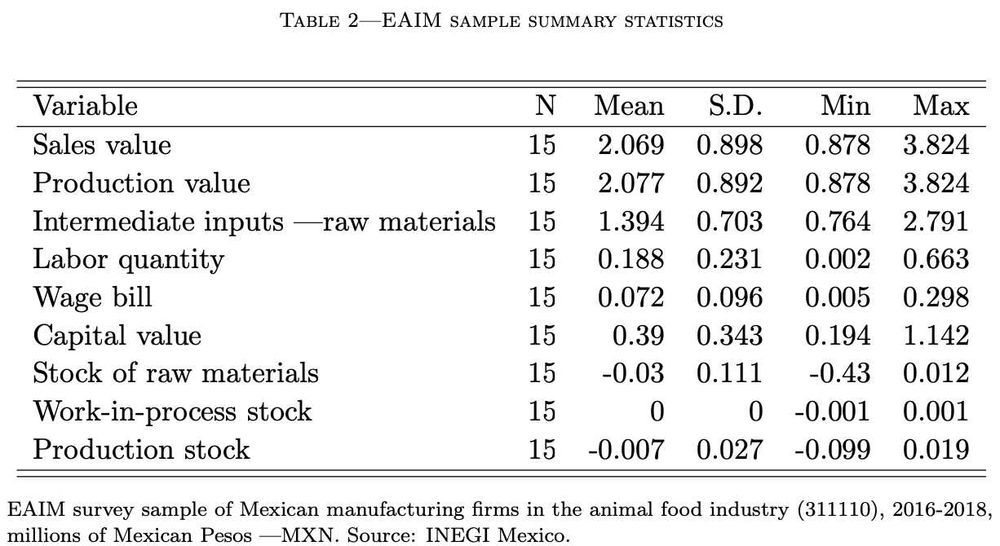

```{r setup, include=FALSE}
options(htmltools.dir.version = FALSE)
knitr::opts_chunk$set(
  fig.width=9, fig.height=3.5, fig.retina=3,
  out.width = "100%",
  cache = FALSE,
  echo = FALSE,
  message = FALSE, 
  warning = FALSE,
  hiline = TRUE
)
```

```{r xaringan-themer, include=FALSE, warning=FALSE}
library(xaringanthemer)
style_duo_accent(
  primary_color = "#4F2683",
  secondary_color = "#4F2683",
  inverse_header_color = "#FFFFFF",
  base_font_size = "30px",
  title_slide_background_image = "Horizontal_Rev.png",
  title_slide_background_size = "5% no-repeat",
  title_slide_background_position = "bottom",
  extra_css = list(
  ".small" = list("font-size" = "80%", 
                  "color" = "#4F2683"),
  ".full-width" = list(
    display = "flex",
    width   = "100%",
    flex    = "1 1 auto"
    ),
  ".footer" = list("color"    = "#4F2683",
                   "position" = "fixed",
                   "top"      = "95%",
                   "left"     = "0",
                   "text-align"= "left",
                   "width"    = "50%",
                   "font-size"= "80%")),
  header_font_google = google_font("Merriweather", "400","400i","700"),
  text_font_google   = google_font("Arimo", "400", "400i"),
  code_font_google   = google_font("IBM Plex Mono")
)
```

## Agenda

- Where we left: 
  - On board to proceed with Tax evasion and Productivity idea
  - Salvador's main concern: too small; why would ______ care?
  - Step back: rethink and start writing (document due July 31)
- Today
  - Question (enlarge)
  - Interesting and relevant (provide)
  - Feasible (improve)

---

## Interest and importance

- Tax evasion, a widespread phenomenon: developed and developing countries .small[(Slemrod, 2019)]
- Not (specifically) addressed before. 
  - Unsatisfactory coping with it in the literature .small[(e.g., Blalock et al., 2004, p.204)]: measurement error
  - Tax-evasion misreporting: unidirectional and follows IC.
- Non-trivial: unobserved and hard to measure. 
  - "Even most credible studies do not have a reliable measure of evasion" .small[(Slemrod, 2019)].

---
## Interest and importance

Bias in productivity measurement due to tax evasion:
- Help explain part of the productivity gap .small[(Syverson, 2011)].
- Needed for the design of public policies aiming at efficient reallocation .small[(Eslava et al., 2004; Levy, 2018)]. 
  - Low-productivity firms might not always be the ones with the larger incentives to evade taxes .small[(e.g., profit threshold for tax regimes with different tax liabilities)].
- Needed to compare productivity across countries. 
  - Different tax systems generate different evasion incentives. More relevant for developing countries.

---

## Clear and original question 

- Can we recover **unbiased** productivity estimates in the presence of systematic misreporting due to tax evasion?
  - at the firm level using a gross-output production function  
  - intermediates, the flexible input
- what is the **magnitude** of this bias, in particular for developing countries?
- how much of the **productivity gap** can tax evasion explain *within* a country and *across* countries?
  - accounting for their different tax systems —rates, rules, and enforcement procedures.

---
### Feasibility - Empirical approach

Tax evasion: Overreporting inputs

$$\begin{aligned}
 X_{it}&=X_{it}^*+\varepsilon^X_{it}(S_{i}) \\
 \varepsilon^X_{it}(S_{i}) &= \left \{ \begin{array}{ll}
 0 &, (1-\tau)\Pi(x_{it}^*) \ge \Pi(x_{it}^*)-\tau\Pi(x_{it})-C(x_{it}-x_{it}^*, s_{i}) \\
 (0,\tilde x] &, \text{otherwise}
 \end{array} \right.
\end{aligned}$$

where $\Pi(X_{it})=P_{t}Y_{it}-\rho_{t} X_{it}$ and $\Pi(\tilde x)=0$

$C(\cdot)=\kappa Pr(a)+c(X_{it}-X_{it}^*, S_{i})$

---
layout: true

### Empirical approach
---

Gross-output production function 

$$\begin{equation*}\label{eq:prod}
 Y_{it}=G(X^*_{it})e^{\omega_{it}+\varepsilon^Y_{it}}
\end{equation*}$$

Productivity measurement bias. Assume CD:

$$\begin{aligned}
 \mathbb{E}[\log Y_{it}|x]&=\mathbb{E}[\beta \log X_{it}|x]+\mathbb{E}[\omega_{it}|x] \\
 \mathbb{E}[\log Y_{it}|x]&=\mathbb{E}[\beta \log(X^*_{it}+\varepsilon^X_{it})|x]+\mathbb{E}[\omega_{it}|x] \\
 \mathbb{E}[\omega_{it}|x]&=\mathbb{E}[\log Y_{it}|x]-\beta \mathbb{E}[\log(X^*_{it}+\varepsilon^X_{it})|x]
\end{aligned}$$

---

$$\begin{aligned}
 \Delta_{\omega}& =\beta \left(\mathbb{E}[\log(X^*_{it}+\varepsilon^X_{it})-\log(X^*_{it})|x]\right) \\
 & = \beta \left(\mathbb{E}[\log\left(\frac{X^*_{it}+\varepsilon^X_{it}}{X^*_{it}}\right)|x]\right) \\
 & \ge \beta \left(\log(\mathbb{E}\left[\frac{X^*_{it}+\varepsilon^X_{it}}{X^*_{it}}|x\right])\right) \\
 & \ge 0
\end{aligned}$$

by Jensen's inequality and because $\varepsilon_{it}^X\ge0$ 

---

> **Identification assumption** : larger firms do not overreport inputs. 

- Costlier to keep the double accounting, higher probability to be denounced to the authority, and access to other legal tools to reduce their tax liabilities.
- Evidence from tax evasion literature: Small and medium size firms .small[Slemrod, 2019]

Let $L(X^*_{it},S_i)=\tau [\Pi(X^*_{it})-\Pi(X_{it})]-C(X_{it}-X^*_{it},S_{i})$. Therefore, for large firms $S_i=s$.

$$\begin{equation}\label{eq:l_ic}
 \mathbb{E}[L(X^*_{it},S_i)|X^*_{it},S_{i}=s]=0
\end{equation}$$

---
layout: true
### Estimation strategy

---

Recovering the joint distribution $f(y_{it},x_{it},p_{t},s_i)=f(y_{it},x_{it},x^*_{it},p_{t},\omega_{it},\omega_{it-1},s_i)$ from the data $\mathcal{O}=\{Y_{it},X_{it},P_{t},S_{i}\}_{i\in I, t \in T}$.

Assumptions: 
1. $f_1(y_{it}|x_{it}, x_{it}^*,\omega_{it},\omega_{it-1}, s_{i}, p_{t})=f_1(y_{it}|x_{it}^*,\omega_{it})$
1. $f_2(p_{t}|x_{it}, x_{it}^*,\omega_{it},\omega_{it-1}, s_{i})=f_2(p_{t}|x_{it}^*)$
1. $f_3(\omega_{it}|x_{it}, x_{it}^*,\omega_{it-1}, s_{i}, p_{t})=f_3(\omega_{it},|\omega_{it-1})$
1. $f_4(x_{it}|x_{it}^*,\omega_{it},\omega_{it-1}, s_{i}, p_{t})=f_4(x_{it}|x_{it}^*,s_{i})$

---

Recast joint distribution as

$$\begin{aligned}
 f&(y_{it},x_{it},p_{t},s_i)\\
 &= f(y_{it},x_{it},p_{t},\omega_{it},\omega_{it-1},x^*_{it},s_i) \\ \notag
 &= f_1(y_{it}| x^*_{it},\omega_{it})
 f_2(p_{it}|x^*_{it},\omega_{it})
 f_3(\omega_{it}|\omega_{it-1})
 f_4(x_{it}|x^*_{it},s_i)
 f(\omega_{it-1})f(x_{it}^*,s_i) \notag
\end{aligned}$$

---

Assuming $f(y_{it},x_{it},p_{t},s_i)$ is time invariant, we can form the quasi likelihood function as follows:

$$\begin{equation*}
 \label{eq:mle_def}
 \sum_{i\in I}\left(
 \sum_{t\in T} \log f(y_{it},x_{it},p_{t},s_i)
 \right) \equiv
 \sum_{i\in I} l(D_i;\alpha)
\end{equation*}$$

in which $D_i=(Y_{it},X_{it},P_{t},S_{i})$ and

---

$$\begin{aligned} \label{eq:mle}
 l(D_i:\alpha) &\equiv l(D_i;\theta, f_1,f_2,f_3,f_4)\notag\\
 &= \sum_{t\in T}\log \bigg\{ 
 \int f_1(y_{it} - g(x^*_{it})+\omega_{it}) \\
 & f_2\left(-\ln\left(\frac{\rho_t X^*_{it}}{P_{t}Y_{it}}\right)+\ln\left(\frac{G_x(x^*_{it})X^*_{it}}{G(x^*_{it})}\right)\right)\\
 & f_3(\omega_{it}-h(\omega_{it-1})) \\
 & f_4(0|s_{i})^{\mathbb 1 [L(x^*_{it},s_i)\ge 0]}
 f_4(x_{it}-x^*_{it}|s_{i})^{\mathbb 1 [L(x^*_{it},s_i) < 0]}dx^* \bigg\} \\
 & + \sum_{t\in T}\log f(\omega_{it-1})f(x_{it}^*,s_i)
\end{aligned}$$

---
layout: false

## Data

- I use anonymized annual tax declarations from a sample of Mexican firms and 
- Survey data at the establishment level for manufacturing firms in Mexico (EAIM-INEGI) and Colombia (EAM)collected annually. 
  - Mexico: No input prices in Mexican data. The tax records cannot be linked to the survey records.
  - Colombia: data on firms does include input prices.

---

<!-- {width="50%"} -->

```{r , echo = FALSE, out.width='80%', fig.align='center'}

```
---



---


---

.pull-left[ **Exploratory analysis**]


```{r , echo = FALSE, out.width='50%', fig.align='center'}

```

---

```{r , echo = FALSE, out.width='50%', fig.align='center'}
knitr::include_graphics('tax_dens_over.png')
```

---
layout: true

### Expected challenges

---

- Firms might cheat on sales. Focus on business-to-business (B2B) sales firms instead of business-to-consumer (B2C) ones .small[Chile (Pomeranz, 2015)]
- Firms might cheat on input prices. Possible solution: base case, lower bound for tax evasion bias. For robustness, model cheating on prices
- Firms might also report losses and use past losses to reduce the tax burden of the current period. Counter-argument: it increases the cheating cost by increasing audit probability. Data shows a high concentration around zero.

---


- No input prices on Mexican data. If firms are price-taking, then a time-dummy can take care of it if firms do not cheat on prices (?)
- In Mexico, if firms are classified as Small or Medium, they are subject to a lower tax rate.
- Colombia: what's the tax evasion evidence? .small[(Ortega and Scartascini, 2015; 2018). Also for Ecuador, Chile, Pakistan.] what's the tax scheme? is there data on firms' taxes? .small[Administrative data: Canada, UK, Brazil, Chile, China, Costa Rica, Ecuador, India, Pakistan, Rwanda, Tunisia, and Uganda.]

---
name: final_slide
count: false
layout: false
class: center middle plain

[hansmartinez.com](hansmartinez.com)

```{r, out.width="90%"}
library(qrcode)
qr <- qrcode::qr_code('https://raw.githack.com/hans-mtz/Slides/main/Slides/DR-062022.html')
plot(qr)

```

.small[ Download slides: Scan QR with your phone's camera ]

<!-- .center[Link to slides: Scan me!] -->
<!-- .footer[ .full-width[Hello there]] -->

