```{r setup, include=FALSE}
options(htmltools.dir.version = FALSE)
knitr::opts_chunk$set(
  fig.width=9, fig.height=3.5, fig.retina=3,
  out.width = "100%",
  cache = FALSE,
  echo = FALSE,
  message = FALSE, 
  warning = FALSE,
  hiline = TRUE
)
```

```{r xaringan-themer, include=FALSE, warning=FALSE}
library(xaringanthemer)
style_duo_accent(
  primary_color = "#4F2683",
  secondary_color = "#4F2683",
  inverse_header_color = "#FFFFFF",
  base_font_size = "30px",
  title_slide_background_image = "Horizontal_Rev.png",
  title_slide_background_size = "4.5% no-repeat",
  title_slide_background_position = "bottom",
  extra_css = list(
  ".small" = list("font-size" = "80%", 
                  "color" = "#4F2683"),
  ".large" = list("font-size" = "130%", 
                  "color" = "#4F2683",
                  "font-family" = "var(--header-font-family)",
                  "font-weight" = "600"),
  ".full-width" = list(
    display = "flex",
    width   = "100%",
    flex    = "1 1 auto"
    ),
  ".footer" = list("color"    = "#4F2683",
                   "position" = "fixed",
                   "top"      = "95%",
                   "left"     = "0",
                   "text-align"= "left",
                   "width"    = "50%",
                   "font-size"= "80%"
                     )
  ),
  header_font_google = google_font("Merriweather", "400","400i","700"),
  text_font_google   = google_font("Arimo", "400", "400i"),
  code_font_google   = google_font("IBM Plex Mono")
)
```

### Agenda

Where we left: 
- Identification strategy: 
  - Motivate $c(\cdot)$ from theory? 
  - What is $s_i$? Do I need it?
- Data

Today
- Data
- Properties of $c(\cdot)$
- Next steps

---
### Data

- Ecuador: I talked to Victor
  - Contacted me with Paul Carrillo (email)
  - Might be able to get them, 
  - we'll need to see about allowing me to use the data

---
### Chile: Annual data

Taxes	
- Sales tax on sales of products, subproducts and finished work
- Sales tax on purchases of raw materials, packaging, etc.
- Consumption tax on sales of products and subproducts
- Import tax on purchases of raw materials, packaging, etc.
- Export tax on sales of products and subproducts
- Total value of indirect taxes

Subsidies	
- Production subsidies
- Export subsidies
- Total value of subsidies

Inventories

---
layout: true
### Colombia 
---

#### DANE
Taxes
- Industry and commerce taxes - Administration and sales
- 4 x 1000 (?)
- Tax on income for equality (?): Production, and Administration and sales

Inventories

---

#### Microestablecimientos

Informatility
- Do they have the unique tax registry (RUT)/ trade registry?
- How do they do their accounting?

#### Innovation and technology
- ISO 9000 & 14000

---
layout: true
### What are the properties of $C(\cdot)$?
---

Firm's problem

\begin{align*}
  \max_{\varepsilon^X \in [0,\infty)} [1-p(\varepsilon^X)]&\left[(Py-\rho x^*) -\tau[Py-\rho(x^*+\varepsilon^X)]\right]\\
  +p(\varepsilon^X)&\left[(1-\tau)(Py-\rho x^*)-\kappa\right]
\end{align*}

---

Rearranging

\begin{align*}
    \max_{\varepsilon^X \in [0,\infty)} (1-\tau)(Py-\rho x^*)+[1-p(\varepsilon^X)]\rho\tau\varepsilon^X - p(\varepsilon^X)\kappa \\  
\end{align*}

- Expected return to evading weighted by the probability of not getting audited
- Expected value of punishment weighted by the probability of getting audited

---

Rearranging

\begin{align*}
    \max_{\varepsilon^X \in [0,\infty)} (1-\tau)(Py-\rho x^*)+\rho\tau \varepsilon^X - p(\varepsilon^X)[\rho\tau\varepsilon^X-\kappa] \\  
\end{align*}

- Linearly increasing in second term
- Las term is $C(\cdot)$ 
  - $C(\cdot)$ is convex if $p(\varepsilon^X)$ is convex


---

Is $p(\varepsilon^X)$ is convex?
- Reinganum and Wilde (1985) show that audit cutoff rules weakly dominate purely random audit rules
- Audit cutoff rule: an agent triggers an audit if reported income is *too low*, not audited if it is *sufficiently high*
- From the agent's perspective, because he does not know $p(\cdot)$, he might perceive a *convexification* of the audit cutoff rule
- In our case, firms will perceive that at low levels of cost overreporting $p(\cdot)$ increases slowly, but past a certain level (and at high levels) of cost overreporting $p(\cdot)$ goes to 1 fast

---

The tax authority might choose different audit probabilities depending on the characteristics of the firm
- Under the audit cutoff rule, high-income agents might evade, only truthful reporting agents are audited
- Reinganum and Wilde (1985) discuss there could be observed characteristics that might be correlated with income
  - They suggest higher cutoffs for agents facing uniform distributions of income with greater mean and the same variance (or greater variance and same mean)
  - for agents with stochastically better uniform distributions of income
  - for agents facing distributions of income stochastically higher

---

Then, $p(\varepsilon^X|s,\xi)$ might depend on 
- observed (to the econometrician) and 
- unobserved (but observed by the tax authority) characteristics of the firms

What matters is the **perceived** audit probability from firms

---
layout: false
### FOC

\begin{equation*}
    \varepsilon^X=\frac{1-p(\varepsilon^X)}{p'(\varepsilon^X)}-\frac{\kappa}{\rho\tau}
\end{equation*}

- $\varepsilon^X$ will decrease if
  - $p(\varepsilon^X)$, $p'(\varepsilon^X)$, or $\kappa$ increase
  - $\rho$ or $\tau$ decrease

---
layout: false
### Next steps

- MC Simulations: 
  - Define the simplest functional model
  - Identification and estimation with the simulated data
- Get data: 
  - Ecuador .small[follow up with V.A.]
  - Mexico .small[ask around]
  - Colombia .small[probably not...]

---
name: final_slide
count: false
layout: false
class: center middle 

[hansmartinez.com](hansmartinez.com)

```{r, out.width="90%"}
library(qrcode)
qr <- qrcode::qr_code('https://raw.githack.com/hans-mtz/Slides/main/Slides/SNDR-08052022.html')
plot(qr)

```

.small[ Download slides: Scan QR with your phone's camera ]

<!-- .center[Link to slides: Scan me!] -->
<!-- .footer[ .full-width[Hello there]] -->


---
layout: false
### Brief literature review

Conventions in the literature .small[(Slemrod, 2019)]:
- Tax avoidance: Legal actions to reduce tax liability
- Tax evasion: Illegal actions to reduce tax liability
- Informality: Small-scale economic activities unobserved by official authorities

---
### What do they do in the tax evasion lit?

- Random audits
  - Tax gap: US, 18.3% overall; UK, 6.4% overall, 6.4% corporate income, 5 % individual, 11.1% VAT; Denmark, 2.2 % overall.
  - Small- and medium-sized enterprises account for 50% of the overall tax gap in the UK .small[(HMRC, 2015)], 47% of individual income in the US, and 14.9% (self-employment income) in Denmark.
- Admin data .small[Canada, UK, Brazil, Chile, China, Costa Rica, Ecuador, India, Pakistan, Rwanda, Tunisia, and Uganda.]
- Experiments (RCT): .small[ Uruguay (Bergolo et al., 2018), Colombia (Ortega & Scartascini, 2018), Chile (Pomenranz, 2015), Ecuador (Carrillo et al., 2017)]
- RD and "bunching" analysis of kinks and notches: .small[Spain (Almunia and Lopez-Rodriguez, 2018); Ecuador (Carrillo et al., 2012)]
- Traces

---
### Traces of true income

- Seminal paper Pissarides and Weber (1989): 
  - Food consumption is a function of income and other characteristics, but not of kind of income, salary versus self-employment income
  - A higher ratio of food purchases to reported income of the self-employed vs employees in the UK implies the self-employed understate their income
- Most recent studies focus on individual income .small[
  - Bank's credit multipliers for employees and self-employed in Greece (Artavanis, 2016); Public vs private sector employees in Estonia (Paulus, 2015); for Canada (Dunbar and Fu, 2015)]
- Trace's estimates are considered as lower bounds of evasion (by the self-employed)
  

---
### Firms' tax evasion

- Import/export tariffs
  - Mislabelling .small[(between China and Hong Kong: Feisman and Wei, 2004)] 
- Payroll taxes
  - Incentive to underreport labor and wages .small[(Mexico: Kumler et al., 2013)]
- Value added tax (VAT)
  - Incentive to underreport sales/overreport costs .small[(Chile: Pomeranz, 2015; for Brazil: Naritomi, 2016)]
- Profit tax (Corporate income tax)
  - Most recent work focuses on revenue underreporting .small[(Ecuador: Carrillo et al., 2017; US: Slemrod et at., 2017; Slemrod, 2019; Pomeranz and Vila-Belda, 2019)], 
  - Few look into **cost overreporting** .small[(Carrillo et al., 2022)].

---
### Cost overreporting through fake invoices by ghost firms

*Carrillo, Donaldson, Pomeranz, and Singhal (2022) NBER Working Paper*

- Internationally prevalent
  - OECD (2017) acknowledges fake invoicing pervasiveness.
  - Mexico (Tax revenue loss 0.3% Mexico's GDP), Colombia (0.2%), Chile (0.2%), Poland (5.6%); Asia: South Korea and China; and Africa: Kenya and Rwanda. 
- "Extremely sparse"
  - Needed data is rare
  - Pakistan: VAT rates reduced to zero, ghost firms decreased .small[(Waseem, 2020)]; ML algorithm to detect ghost firms .small[(Mittal et al., 2018)]


---
### Carrillo et al. (2022)

- Authors exploit **transaction-level data** from Ecuador and a **list of ghost firms** —pre-identified by the tax authority— to document new facts about the use of fake invoices to evade taxes. 
- Data covers the period before and after **government intervention** —emails challenging ghost clients misreporting.
- Ghost transactions are **widespread** and **quantitatively large** 
  - Not limited to small, semi-formal firms; **Larger firms** are more likely to engage in ghost transactions
  - Annual ghost purchases reached 14.1% of the value of firms' total purchases. 4.7% of potential clients engaged in ghost transactions.


---
### In the context of my approach


- Monotonic relation between size and tax evasion .small[
  - The probability of engaging in cost overreporting through ghost firms increases monotonically in firm revenue.]
- Firms at the top of the size distribution don't overreport inputs .small[
  - Share of ghost deductions increases throughout much of the size distribution, *except at the very top* —very large corporations might have stronger incentives to avoid illegal behavior or they can use more sophisticated avenues of tax avoidance that do not require evasion using fake receipts (Bustos et al., 2022)]
- Timing of the evasion decision .small[
  - Ghost transactions are clustered towards the end of the tax year
- Consistent with firms assessing their annual revenues at the end of the year and then utilizing ghost transactions to achieve a target reported profit level or rate for tax purposes]

---
### In the context of my approach

- No economic activity behind overreporting .small[
  - Ghost transactions bunch at round numbers
- Ghost transactions bunch below the financial system payment threshold]
- Cost overreporting mainly on non-labor costs (intermediates) .small[
  - Adjusting firms reduced most strongly non-labor costs: domestic purchases, other production costs, and imports]
- No underreporting in firm-to-firm sales .small[
  - There was no offsetting behavior as in revenue misreporting studies]
- Conditional on being identified as a ghost client, the overreporting level does affect your probability of being audited .small[
  - Notified firms had 2.4 times higher median tax liability, the median amount of ghost deductions of these firms was $181,000 (mean $338,000) and the median share of ghost deductions out of their total purchases was 26% (mean 38%)]
  

---
layout: true
### What goes into $C(\cdot)$?

---

Reinganum and Wilde (1985): .small[Building from Townsend (1979), Allingham  and  Sandmo (1972), and Becker (1968)]

Agent's problem: 
\begin{equation*}
  r(x,I)=[1-p(x)](I-t(x))+p(x)(I-f(x,I))
\end{equation*}

Agent chooses her report $x$ to maximize $r(x,I)$, given tax owed $t(x)$, tax owed plus fines $f(x,I)$, and the audit probability function $p(x)$. $I$ is a random variable iid $\sim G(I)$, with $g(I)=G'(I) \; \forall I \in [0,\infty)$

Optimal report $\phi (I)$ may be a correspondence

---

Principal's problem:

\begin{equation*}
  R(x,I)=[1-p(x)]t(x)+p(x)[(x,I)-c]
\end{equation*}

Principal chooses $t(\cdot)$, $f(\cdot,I)$, an audit probability function $p(\cdot)$, and a report $x\in \phi(I)$ to maximize $\mathbb E [R(x,I)]$ (expectation taken wrt $G(I)$ ).

---

Recently, the Allingham and Sandmo framework has often been replaced by a simpler deterrence model where the maximand is just

\begin{equation*}
  y(1-t)+te-c(e,\alpha) \;\; {\scriptsize \text{(Slemrod, 2019)}}
\end{equation*}

- $c$ private cost of evasion, which includes 
  - the utility cost of bearing risk and 
  - the expected value of punishment. 
- The private cost may depend on 
  - the amount of attempted evasion $e$ and 
  - certainly depends on the vector $\alpha$ of enforcement instruments, like the extent of auditing. 

---
layout: false

### My little model

In my model's parametrization, 

\begin{equation*}
  C(x_i-x_i^*, s_i; \alpha)=\alpha_0(x_i-x_i^*) s_i+\alpha_1^{(x_i-x_i^*)}
\end{equation*}

Changes in the audit probability and the expected value of punishment can be adjusted by changes in $\alpha$.

---
### What is $s_i$?

- Revenue / Sales / Market share
- Age .small[No evidence that the intervention was followed by firms going out of business or de-formalizing; consistent with ghost clients being large and established (Carrillo et al., 2022)]
- Number of employees .small[Self-employed income accounts for a large share of tax evasion across countries (Slemrod, 2019)]
- Exporting status .small[Ghost deductions are a large share of over-claimed refunds for exporters (Pakistan: Waseem, 2020)]
- Owner characteristics:
  - Income .small[Ghost deductions are most prevalent in firms owned by high-income individuals (Carrillo et al., 2022)]
  - Multiple firms
  - Experience with previous companies

---
### What is $s_i$ in the full model?

Recovering the joint distribution $f(y_{it},x_{it},p_{t},s_i)=f(y_{it},x_{it},x^*_{it},p_{t},\omega_{it},\omega_{it-1},s_i)$ from the data $\mathcal{O}=\{Y_{it},X_{it},P_{t},S_{i}\}_{i\in I, t \in T}$.

Assumptions: 
1. $f_1(y_{it}|x_{it}, x_{it}^*,\omega_{it},\omega_{it-1}, s_{i}, p_{t})=f_1(y_{it}|x_{it}^*,\omega_{it})$
1. $f_2(p_{t}|y_{it}, x_{it}, x_{it}^*,\omega_{it},\omega_{it-1}, s_{i})=f_2(p_{t}|y_{it}, x_{it}^*)$
1. $f_3(\omega_{it}|y_{it}, x_{it}, x_{it}^*,\omega_{it-1}, s_{i}, p_{t})=f_3(\omega_{it},|\omega_{it-1})$
1. $f_4(x_{it}|y_{it}, x_{it}^*,\omega_{it},\omega_{it-1}, s_{i}, p_{t})=f_4(x_{it}|x_{it}^*,s_{i})$


---
### Ideal project

- Cautionary tale about $\omega_{it}$ bias and reshuffling due to tax evasion
- Propose method to estimate $\omega_{it}$ without transaction-level data and ghost firm list (bounds)
- Obtain transaction-level data and ghost firm list and contrast estimates (verification data)
- Relevant for:
  - Practitioners: Productivity is an input for numerous fields (trade, growth and development, etc.)
  - Policy: 
    1. Tax evasion: (bound) estimates for evasion by firms. Help efficient targeting of firms.
    2. Productivity growth: (bound) estimates for productivity bias by firms. Help efficient reallocation from low to high productivity firms.


---
layout: true
### The simplified model
---

- Price-taking firms maximize after-tax profits in a two-stage game. 
- Before the start, firm $i \in \mathcal I$ gets a random draw of productivity $\omega_i$ with probability distribution function (pdf) $f_\omega$ and size $s_i$ with pdf $f_s$. 
- In the first stage, firms maximize before-tax profits given input and output prices, $\rho$ and $P$, the production function $G(\cdot)$, and their productivity $\omega_i$.

\begin{equation*}
  \max_{x_i \in \mathcal X} P G(x_i)e^{\omega_{i}}-\rho x_i
\end{equation*}

- Their optimal input choice is $x_i^*$. 
- Output is $y_i=G(x^{*}_{i})e^{\omega_{i}}$

---

- In the second stage, firms choose how much inputs to overreport to maximize their after-tax profits, given the tax rate $\tau$, their optimal input choice $x_i^*$ of the first stage, their size $s_i$, and the tax-evasion cost. 
- The cost function of the tax-evasion decision is strictly increasing and convex on the overreporting and strictly increasing the firm's size. 

\begin{equation*}
  \max_{x \in \mathcal X} (1-\tau)P y_i - \rho (x_i^*-\tau x_i)-C(x_i-x_i^*, s_i)
\end{equation*}

- The optimal overreporting input choice is $\tilde{x}_i$.

---

- Finally, firms choose to overreport if the after-tax profits, $V^E=(1-\tau)P y_i - \rho (x_i^*-\tau \tilde{x}_i)-C(\tilde{x}_i-x_i^*, s_i)$, 
- are greater than reporting the truth, $V^T=(1-\tau)(P y_i - \rho x_i^*)$.

\begin{equation*}
  \max \{V^T, V^E\}
\end{equation*}

---
layout: true
### Monte Carlo simulations
---

.pull-left[
Functional forms for $n=1,000$ firms:

\begin{align*}
  G(x_i)e^{\omega_i}&=x_i^\beta e^{\omega_i} \\
  C(x_i-x_i^*, s_i)&=(x_i-x_i^*)\gamma s_i+\alpha^{(x_i-x_i^*)}
\end{align*}
]
.pull-right[
FOC's become

\begin{align}
  x_i^*&=\left(\frac{\beta P e^{\omega_i}}{\rho}\right)^{\frac{1}{1-\beta}} \\
  \tilde{x}_i&=  \frac{\log\left(\frac{\tau\rho-\gamma s_i}{\log\alpha}\right)}{\log \alpha}+ x_i^*
\end{align}
]
---

- $\omega_i \sim N(0,1)$ and $s_i\sim U[1,50]$.

| Parameter  | Value |
|:---------: |------:|
|&beta;      | 0.4   |
|&gamma;     | 0.0059|
|&alpha;     | 1.05  |
|&tau;       | 0.30  |
|&rho;       | 1.00  |
|p           | 2.00  |


---
layout: false

### 1st stage

.center[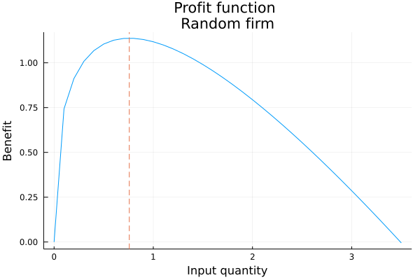]

---
### 2nd stage

.pull-left[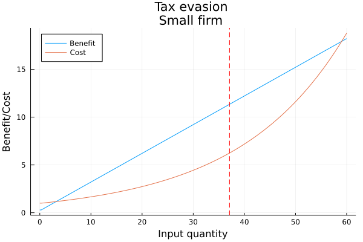]
.pull-right[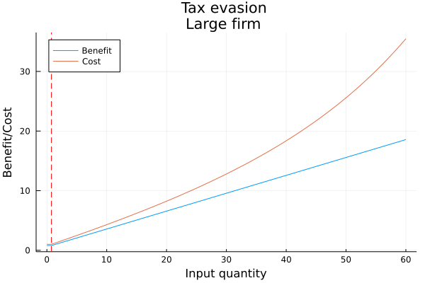]

---
### Tax evasion

.pull-left[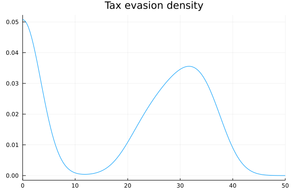]
.pull-right[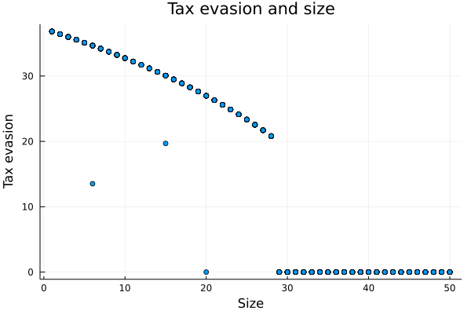]

---
### Tax evasion

.center[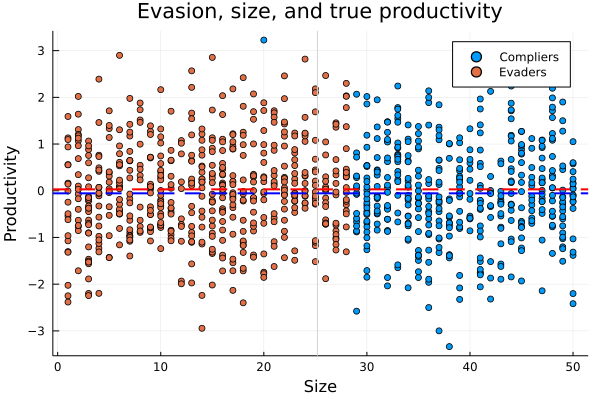]

---
layout: true
### Recovering productivity
---

1. OLS: $\log y_i = \beta \log x_i + \omega_i$
2. IV: $\log y_i =  \beta \log x_i + \delta \log s_i + \omega_i$
3. 2SIV: 1S $\log x_i = \alpha \log s_i + \varepsilon_i$; 2S $\log y_i =  \beta \log \hat{x}_i + \omega_i$
4. FOC: 

\begin{align}
  \frac{\rho x_i}{P y_i} &= \frac{\beta e^{\omega_i} x_i}{x_i^{1-\beta} x_i^{\beta} e^{\omega_i}} \\
  \frac{\rho x_i}{P y_i} &= \beta \\
  \hat{\omega}&=\log y_i - \hat{\beta} \log x_i
\end{align}

---

.center[
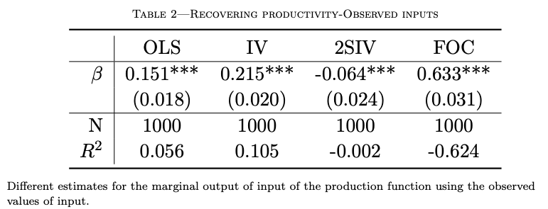
]

---

.center[
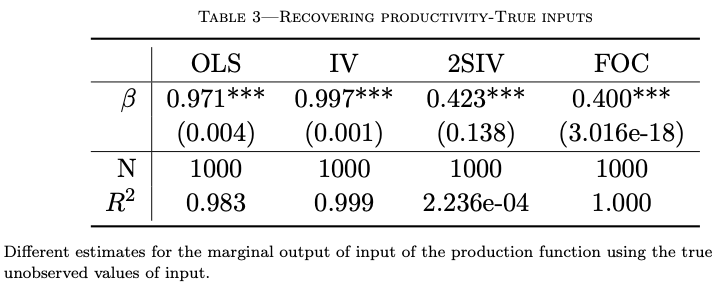
]

---


.pull-left[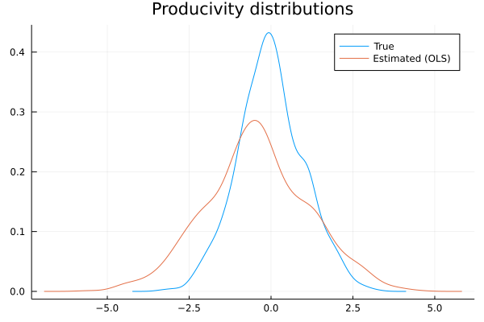]
.pull-right[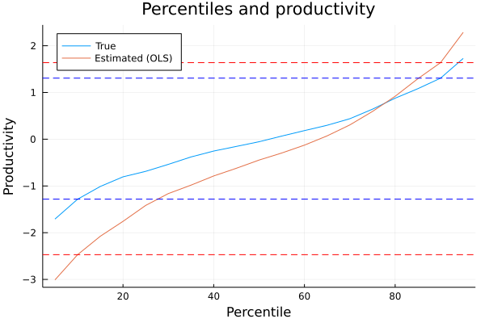]


---

.pull-left[]
.pull-right[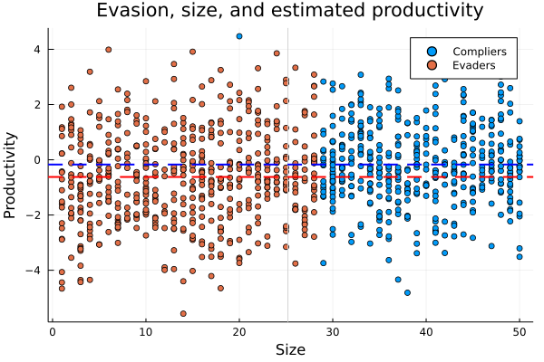]

---

```{r diff_mean, echo = FALSE}
diff_mean<-read.csv("tables/diff-means-prod.csv")
knitr::kable(diff_mean)
```

---
layout: true
### Policy counterfactual
---

Policy aiming to reduce the productivity gap by reallocating resources from the lowest quartile of productivity distribution to high-productivity firms .small[(Eslava et al., 2004; Levy 2018)]

All else equal, the firms in the lowest quartile of the productivity distribution go out of the market.

```{r policy, echo = FALSE}
diff_mean<-read.csv("tables/policy.csv")
knitr::kable(diff_mean)
```

---
layout: false
### Why does it matter?

- Ignoring tax evasion leads to a repositioning of firms in the naive measure of the productivity distribution. This is Policy-relevant.
- Explain why small firms are consistently measured as low-productive?
- Explain the survival of small low-productivity firms in the market (?)


---

## Interest and importance

- Tax evasion, a widespread phenomenon: developed and developing countries .small[(Slemrod, 2019)]
- Not (specifically) addressed before. 
  - Unsatisfactory coping with it in the literature .small[(e.g., Blalock et al., 2004, p.204)]: measurement error
  - Tax-evasion misreporting: unidirectional and follows IC.
- Non-trivial: unobserved and hard to measure. 
  - "Even most credible studies do not have a reliable measure of evasion" .small[(Slemrod, 2019)].

---
## Interest and importance

Bias in productivity measurement due to tax evasion:
- Help explain part of the productivity gap .small[(Syverson, 2011)].
- Needed for the design of public policies aiming at efficient reallocation .small[(Eslava et al., 2004; Levy, 2018)]. 
  - Low-productivity firms might not always be the ones with the larger incentives to evade taxes .small[(e.g., profit threshold for tax regimes with different tax liabilities)].
- Needed to compare productivity across countries. 
  - Different tax systems generate different evasion incentives. More relevant for developing countries.

---

## Clear and original question 

- Can we recover **unbiased productivity** estimates in the presence of systematic misreporting due to **tax evasion**?
  - at the firm level using a gross-output production function  
  - intermediates, the flexible input
- what is the **magnitude** of this bias, in particular for developing countries?
- how much of the **productivity gap** can tax evasion explain *within* a country and *across* countries?
  - accounting for their different tax systems —rates, rules, and enforcement procedures.

---


layout: false

### Feasibility - Empirical approach

Tax evasion: Overreporting inputs

$$\begin{aligned}
 X_{it}&=X_{it}^*+\varepsilon^X_{it}(S_{i}) \\
 \varepsilon^X_{it}(S_{i}) &= \left \{ \begin{array}{ll}
 0 &, (1-\tau)\Pi(x_{it}^*) \ge \Pi(x_{it}^*)-\tau\Pi(x_{it})-C(x_{it}-x_{it}^*, s_{i}) \\
 (0,\tilde x] &, \text{otherwise}
 \end{array} \right.
\end{aligned}$$

where $\Pi(X_{it})=P_{t}Y_{it}-\rho_{t} X_{it}$ and $\Pi(\tilde x)=0$

$C(\cdot)=\kappa Pr(a)+c(X_{it}-X_{it}^*, S_{i})$

---
layout: true

### Empirical approach
---

Gross-output production function 

$$\begin{equation*}\label{eq:prod}
 Y_{it}=G(X^*_{it})e^{\omega_{it}+\varepsilon^Y_{it}}
\end{equation*}$$

Productivity measurement bias. Assume CD:

$$\begin{aligned}
 \mathbb{E}[\log Y_{it}|x]&=\mathbb{E}[\beta \log X_{it}|x]+\mathbb{E}[\omega_{it}|x] \\
 \mathbb{E}[\log Y_{it}|x]&=\mathbb{E}[\beta \log(X^*_{it}+\varepsilon^X_{it})|x]+\mathbb{E}[\omega_{it}|x] \\
 \mathbb{E}[\omega_{it}|x]&=\mathbb{E}[\log Y_{it}|x]-\beta \mathbb{E}[\log(X^*_{it}+\varepsilon^X_{it})|x]
\end{aligned}$$

---

$$\begin{aligned}
 \Delta_{\omega}& =\beta \left(\mathbb{E}[\log(X^*_{it}+\varepsilon^X_{it})-\log(X^*_{it})|x]\right) \\
 & = \beta \left(\mathbb{E}[\log\left(\frac{X^*_{it}+\varepsilon^X_{it}}{X^*_{it}}\right)|x]\right) \\
 & \ge \beta \left(\log(\mathbb{E}\left[\frac{X^*_{it}+\varepsilon^X_{it}}{X^*_{it}}|x\right])\right) \\
 & \ge 0
\end{aligned}$$

by Jensen's inequality and because $\varepsilon_{it}^X\ge0$ 

---

> **Identification assumption** : larger firms do not overreport inputs. 

- Costlier to keep the double accounting, higher probability to be denounced to the authority, and access to other legal tools to reduce their tax liabilities.
- Evidence from tax evasion literature: Small and medium size firms .small[Slemrod, 2019]

Let $L(X^*_{it},S_i)=\tau [\Pi(X^*_{it})-\Pi(X_{it})]-C(X_{it}-X^*_{it},S_{i})$. Therefore, for large firms $S_i=s$.

$$\begin{equation}\label{eq:l_ic}
 \mathbb{E}[L(X^*_{it},S_i)|X^*_{it},S_{i}=s]=0
\end{equation}$$

---
layout: true
### Estimation strategy

---

Recovering the joint distribution $f(y_{it},x_{it},p_{t},s_i)=f(y_{it},x_{it},x^*_{it},p_{t},\omega_{it},\omega_{it-1},s_i)$ from the data $\mathcal{O}=\{Y_{it},X_{it},P_{t},S_{i}\}_{i\in I, t \in T}$.

Assumptions: 
1. $f_1(y_{it}|x_{it}, x_{it}^*,\omega_{it},\omega_{it-1}, s_{i}, p_{t})=f_1(y_{it}|x_{it}^*,\omega_{it})$
1. $f_2(p_{t}|x_{it}, x_{it}^*,\omega_{it},\omega_{it-1}, s_{i})=f_2(p_{t}|x_{it}^*)$
1. $f_3(\omega_{it}|x_{it}, x_{it}^*,\omega_{it-1}, s_{i}, p_{t})=f_3(\omega_{it},|\omega_{it-1})$
1. $f_4(x_{it}|x_{it}^*,\omega_{it},\omega_{it-1}, s_{i}, p_{t})=f_4(x_{it}|x_{it}^*,s_{i})$

---

Recast joint distribution as

$$\begin{aligned}
 f&(y_{it},x_{it},p_{t},s_i)\\
 &= f(y_{it},x_{it},p_{t},\omega_{it},\omega_{it-1},x^*_{it},s_i) \\ \notag
 &= f_1(y_{it}| x^*_{it},\omega_{it})
 f_2(p_{it}|x^*_{it},\omega_{it})
 f_3(\omega_{it}|\omega_{it-1})
 f_4(x_{it}|x^*_{it},s_i)
 f(\omega_{it-1})f(x_{it}^*,s_i) \notag
\end{aligned}$$

---

Assuming $f(y_{it},x_{it},p_{t},s_i)$ is time invariant, we can form the quasi likelihood function as follows:

$$\begin{equation*}
 \label{eq:mle_def}
 \sum_{i\in I}\left(
 \sum_{t\in T} \log f(y_{it},x_{it},p_{t},s_i)
 \right) \equiv
 \sum_{i\in I} l(D_i;\alpha)
\end{equation*}$$

in which $D_i=(Y_{it},X_{it},P_{t},S_{i})$ and

---

$$\begin{aligned} \label{eq:mle}
 l(D_i:\alpha) &\equiv l(D_i;\theta, f_1,f_2,f_3,f_4)\notag\\
 &= \sum_{t\in T}\log \bigg\{ 
 \int f_1(y_{it} - g(x^*_{it})+\omega_{it}) \\
 & f_2\left(-\ln\left(\frac{\rho_t X^*_{it}}{P_{t}Y_{it}}\right)+\ln\left(\frac{G_x(x^*_{it})X^*_{it}}{G(x^*_{it})}\right)\right)\\
 & f_3(\omega_{it}-h(\omega_{it-1})) \\
 & f_4(0|s_{i})^{\mathbb 1 [L(x^*_{it},s_i)\ge 0]}
 f_4(x_{it}-x^*_{it}|s_{i})^{\mathbb 1 [L(x^*_{it},s_i) < 0]}dx^* \bigg\} \\
 & + \sum_{t\in T}\log f(\omega_{it-1})f(x_{it}^*,s_i)
\end{aligned}$$

---
layout: false

## Data

- I use anonymized annual tax declarations from a sample of Mexican firms and 
- Survey data at the establishment level for manufacturing firms in Mexico (EAIM-INEGI) and Colombia (EAM) collected annually. 
  - Mexico: No input prices in Mexican data. The tax records cannot be linked to the survey records.
  - Colombia: data on firms does include input prices.

---

<!-- 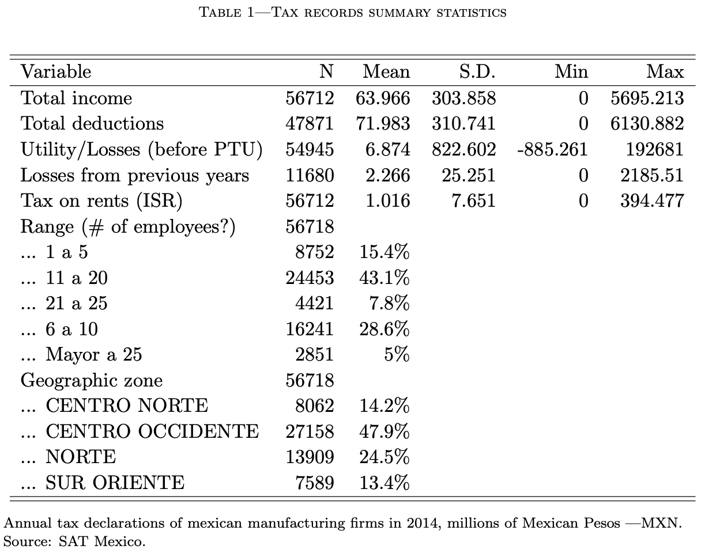{width="50%"} -->

```{r , echo = FALSE, out.width='75%', fig.align='center'}

```
---

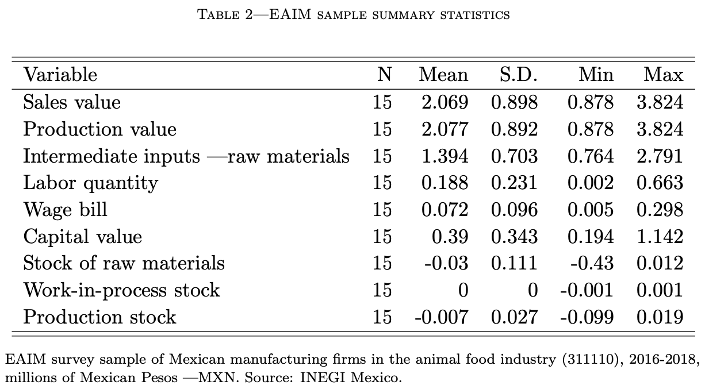

---

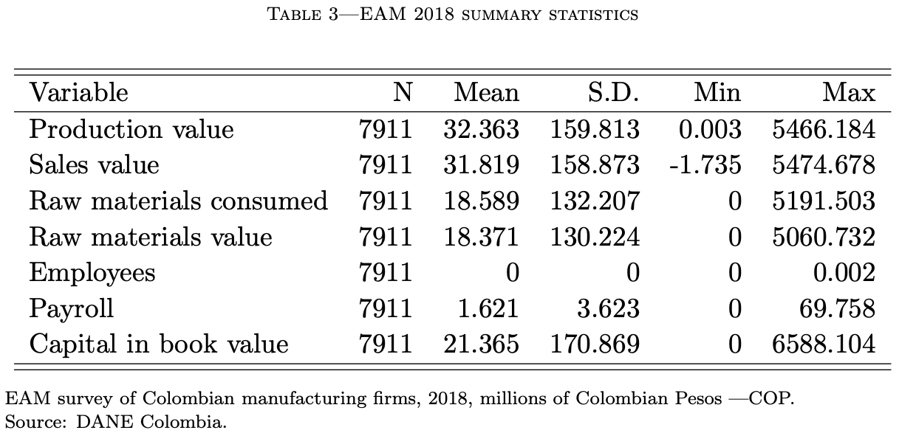

---

.pull-left[ .large[Exploratory analysis]]


```{r , echo = FALSE, out.width='50%', fig.align='center'}
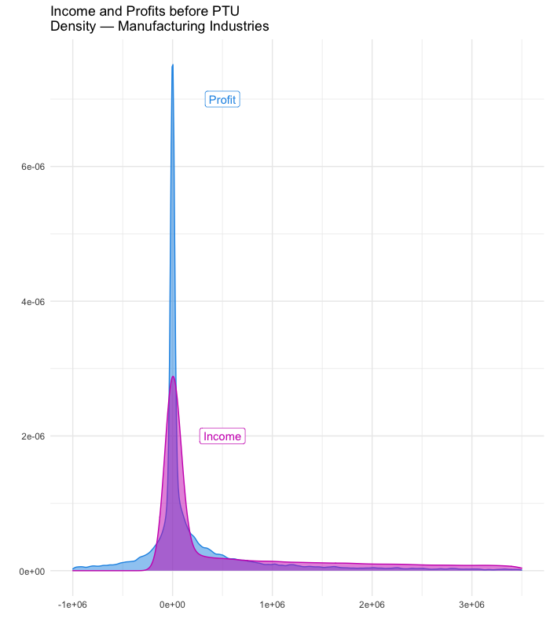
```

---

```{r , echo = FALSE, out.width='50%', fig.align='center'}
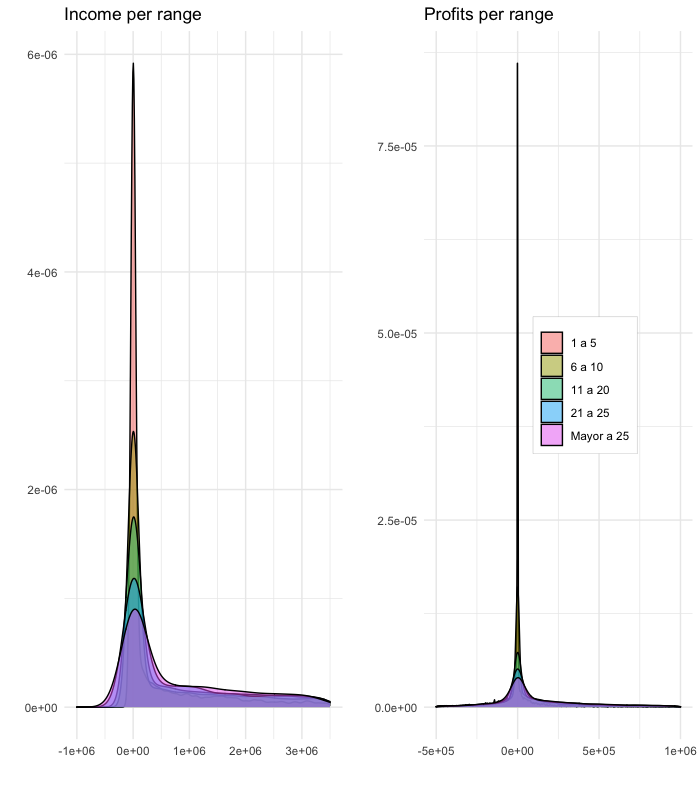
```

---
layout: true

### Expected challenges

---

- Firms might cheat on sales. 
  - Focus on business-to-business (B2B) sales firms instead of business-to-consumer (B2C) ones .small[(Chile; Pomeranz, 2015)]
- Firms might cheat on input prices. 
  - Possible solution: base case, lower bound for tax evasion bias. For robustness, model cheating on prices.
- Firms might also report losses and use past losses to reduce the tax burden of the current period. 
  - Counter-argument: it increases the cheating cost by increasing audit probability. Data shows a high concentration around zero.

---

- No input prices on Mexican data. 
  - If firms are price-taking, then a time-dummy can take care of it if firms do not cheat on prices (?)
- In Mexico, if firms are classified as Small or Medium, they are subject to a lower tax rate.
- Colombia: 
  - what's the tax evasion evidence? .small[(Ortega and Scartascini, 2015; 2018). Also for Ecuador, Chile, Pakistan.] 
  - what's the tax scheme? 
  - is there data on firms' taxes? .small[Administrative data: Canada, UK, Brazil, Chile, China, Costa Rica, Ecuador, India, Pakistan, Rwanda, Tunisia, and Uganda.]

---
### Identification

Hu (2021), Hu, Schennach, Shiu (2022),and  Hu & Yao (2022) study this problem:

\begin{equation*}
  Y=m(X^*)+\varepsilon_Y
  X=X^*+\varepsilon_X
\end{equation*}

- Partial identification
- Z={}

---
### Identification

In the tax evasion literature
