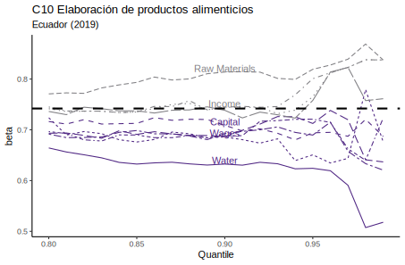
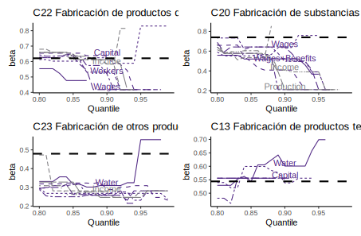
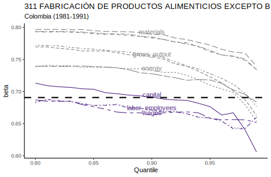
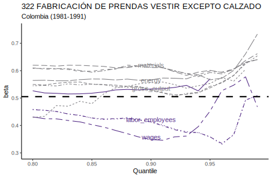
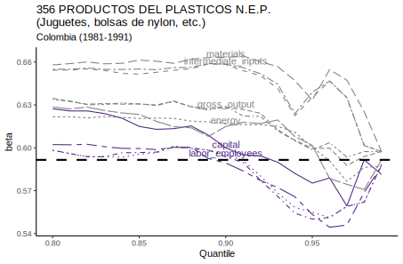
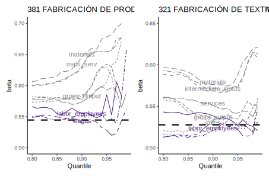
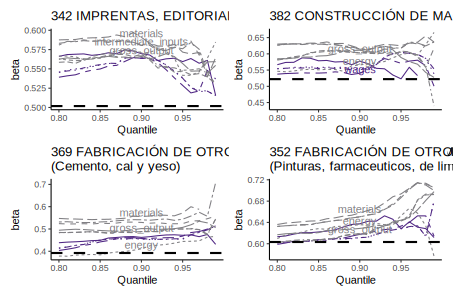

count: false

```{r setup, include=FALSE}
options(htmltools.dir.version = FALSE)
knitr::opts_chunk$set(
  fig.width=9, fig.height=3.5, fig.retina=3,
  out.width = "100%",
  cache = FALSE,
  echo = FALSE,
  message = FALSE, 
  warning = FALSE,
  hiline = TRUE
)
library("kableExtra")
# library("tydiverse")
```

```{r xaringan-themer, include=FALSE, warning=FALSE}
library(xaringanthemer)
style_duo_accent(
  primary_color = "#4F2683",
  secondary_color = "#807F83",
  inverse_header_color = "#FFFFFF",
  inverse_text_color = "#FFFFFF",
  inverse_background_color = "#4F2683",
  base_font_size = "30px",
  title_slide_background_image = "Horizontal_Rev.png",
  title_slide_background_size = "4.5% no-repeat",
  title_slide_background_position = "bottom",
  extra_css = list(
  ".small" = list("font-size" = "80%", 
                  "color" = "#807F83"),
  ".large" = list("font-size" = "130%", 
                  "color" = "#4F2683",
                  "font-family" = "var(--header-font-family)",
                  "font-weight" = "600"),
  ".full-width" = list(
    display = "flex",
    width   = "100%",
    flex    = "1 1 auto"
    ),
  ".footer" = list("color"    = "#807F83",
                   "position" = "fixed",
                   "top"      = "95%",
                   "left"     = "0",
                   "text-align"= "left",
                   "width"    = "50%",
                   "font-size"= "80%"
                     )
  ),
  header_font_google = google_font("Merriweather", "400","400i","700"),
  text_font_google   = google_font("Arimo", "400", "400i"),
  code_font_google   = google_font("IBM Plex Mono")
)
```
## Agenda

- Testing FOC in the data
  - Ecuador
  - Colombia
- Moving away from Cobb-Douglas

---
### Estimating FOC

I estimated the FOC of my setup 

\begin{equation}
    \mathbb{E}\left[\ln\left(\frac{\rho_t X^*_{it}}{P_{t}Y_{it}}\right)| S_{it}>s\right]+\mathbb{E}[\varepsilon^X_{it}| S_{it}>s]=\ln\beta - \mathbb{E}[\varepsilon^Y_{it}| S_{it}>s]
\end{equation}

- using different measures of size
  - $\varepsilon^Y \perp S$: Capital and Labor related (Employees, Wages)
  - $\varepsilon^Y \not\perp S$: Sales, Output, Intermediates
- for the top quantiles (80th and above)
- I focused on the industries with the largest number of firms

---
### Estimating FOC

Under the assumptions of my setup:

\begin{equation}
    \mathbb{E}\left[\ln\left(\frac{\rho_t X^*_{it}}{P_{t}Y_{it}}\right)\right]+\mathbb{E}[\varepsilon^X_{it}] >
    \mathbb{E}\left[\ln\left(\frac{\rho_t X^*_{it}}{P_{t}Y_{it}}\right)| S_{it}>s\right]+\mathbb{E}[\varepsilon^X_{it}| S_{it}>s]
\end{equation}

Data:
- Ecuador: (2019) Intermediates are raw materials (no energy, no services)
- Colombia: (1981-1991) Intermediates are real intermediates (raw materials, services, and energy)

---
```{r EC_sum_stats, echo = FALSE}
# results<-read.csv("tables/results.csv")
# opts <- options(knitr.kable.NA = "")
# knitr::kable(results, digits=3)
load("../Results/EC.RData")

sum_stat_EC[,1:6] %>%
  knitr::kable(caption="Ecuador (2019)",
      col.names = c(
        "SIC",
        "Industry",
        "Obs.",
        "Avg. Sales (millions)",
        "SD Sales (millions)",
        "Missing obs. Sales"#,
        # "Avg. Inputs (millions)",
        # "SD Inputs (millions)",
        # "Missing obs. Inputs"
      ),
      digits=4) %>%
  kable_classic(full_width = TRUE, html_font = "Cambria") #%>%
  # add_header_above(c(" "=1, "\\(\\beta=0.4\\)"=3,"\\(\\delta=0.8\\)"=3),escape=TRUE)

```
---
```{r CO_sum_stats, echo = FALSE}
# results<-read.csv("tables/results.csv")
# opts <- options(knitr.kable.NA = "")
# knitr::kable(results, digits=3)
load("../Results/CO.RData")

sum_stat_CO[1:6,1:6] %>%
  knitr::kable(caption="Colombia (1981-1991)",
      col.names = c(
        "SIC",
        "Industry",
        "Obs.",
        "Avg. Sales (thousand)",
        "SD Sales (thousand)",
        "Missing obs. Sales"#,
        # "Avg. Inputs (millions)",
        # "SD Inputs (millions)",
        # "Missing obs. Inputs"
      ),
      digits=4) %>%
  kable_classic(full_width = TRUE, html_font = "Cambria") #%>%
  # add_header_above(c(" "=1, "\\(\\beta=0.4\\)"=3,"\\(\\delta=0.8\\)"=3),escape=TRUE)

```
---
```{r CO_sum_stats_2, echo = FALSE}
# results<-read.csv("tables/results.csv")
# opts <- options(knitr.kable.NA = "")
# knitr::kable(results, digits=3)
load("../Results/CO.RData")

sum_stat_CO[7:10,1:6] %>%
  knitr::kable(caption="Colombia (1981-1991) (continued)",
      col.names = c(
        "SIC",
        "Industry",
        "Obs.",
        "Avg. Sales (thousand)",
        "SD Sales (thousand)",
        "Missing obs. Sales"#,
        # "Avg. Inputs (millions)",
        # "SD Inputs (millions)",
        # "Missing obs. Inputs"
      ),
      digits=4) %>%
  kable_classic(full_width = TRUE, html_font = "Cambria") #%>%
  # add_header_above(c(" "=1, "\\(\\beta=0.4\\)"=3,"\\(\\delta=0.8\\)"=3),escape=TRUE)

```
---
```{r , echo = FALSE, out.width='90%', fig.align='center', caption="Holi"}

```
---

```{r , echo = FALSE, out.width='90%', fig.align='center'}

```
---

```{r , echo = FALSE, out.width='90%', fig.align='center'}

```
---

```{r , echo = FALSE, out.width='90%', fig.align='center'}

```
---

```{r , echo = FALSE, out.width='90%', fig.align='center'}

```
---

```{r , echo = FALSE, out.width='90%', fig.align='center'}

```
---

```{r , echo = FALSE, out.width='90%', fig.align='center'}

```
---
### In summary

- Some evidence of tax evasion through cost overreporting, for manufacturing industries:
  -  C10-Food products in Ecuador (2019), and 
  -  311-Food products, 322-Apparel, 356-Plastic products in Colombia (1981-1991)

- For other industries:
  - Production function might not be Cobb-Douglas
  - Changes in common technology or evasion behavior over time
  - Large established firms might be the non-compliers

---
### Moving away from CD

\begin{align}
  Y&=m_0(X^*)+\eta \\
  X&=X^*+\varepsilon \\
  \varepsilon &\not\perp X^*
\end{align}

**Theorem Hu et al.(2022)**: Under the following assumptions, given the observed density $f_{Y,X}(Y,X)$:

  1. Regularity conditions on densities $f_{X,X^*}, f_{X|X^*}, f_{X^*}$
  2. Regression Error $\mathbb{E}[\eta| X^*]=0$ and $\eta\perp\varepsilon$
  3. Measurement error $f(y|x^*,x)=f(y|x^*)$ and $G[f_{X|X^*}(\cdot|x^*)]=x^*$
  4. Regression function $m_0$ monotone function

---
### Moving away from CD

**Theorem Hu et al.(2022) (*continued*...)**

The equation 

\begin{equation}
  f_{Y,X}(y,x) = \int_{\mathcal X^*} f_{\eta}(y-m_0(X^*))f_{X|X^*}(x|x^*)f_{X^*}(x^*)dx^* 
\end{equation}

permits a unique solution $(m_0,f_{\eta},f_{X|X^*},f_{X^*})\equiv \alpha_0$. The solution characterizes the nonparametric regression model $Y=m_0(X^*)+\eta$.

---
### Mapping to Tax Evasion

$m_0\equiv\ln\left(\frac{G'(X)X}{G(X)}\right)$, for example,
  - CD: $G(X)= \beta_0 + \beta_1 \ln X + \omega + \eta$; $m_0\equiv \beta_1$
  - Trans-log: $G(X)= \beta_0 + \beta_1 \ln X + \beta_2 (\ln X)^2 + \omega + \eta$: $m_0\equiv\ln\left( \beta_1 + 2\beta_{2}\ln X \right)$ for $X\in\left(exp(-\frac{\beta_1}{2\beta_2}),\infty\right)$

$G[f_{X|X^*}(\cdot|x^*)]\equiv E[x|x*,S>s]=x^*$

I could recover $(m_0, f_{\eta}, f_{\varepsilon}, f_{X^*})$


---
name: final_slide
count: false
layout: false
class: center middle last

[hansmartinez.com](https://hansmartinez.com)

```{r, out.width="90%"}
library(qrcode)
qr <- qrcode::qr_code('https://raw.githack.com/hans-mtz/Slides/main/Slides/prospectus-HM.html')
plot(qr)

```

.small[ Download slides: Scan QR with your phone's camera ]

<!-- .center[Link to slides: Scan me!] -->
<!-- .footer[ .full-width[Hello there]] -->

---
class: inverse center middle 
count: false
## Appendix

---
name: over-r
count: false
### Tax evasion by input overreporting

- Firms might **reduce** their tax burden by **overreporting** expenses .small[(VAT, Profit tax)]

--
count: false
- **International** problem

  - OECD acknowledges its pervasiveness .small[(OECD, 2017)]
  - Mexico .small[(Tax revenue loss 0.3% Mexico's GDP)], Colombia .small[(0.2%)], Chile .small[(0.2%)], Poland .small[(5.6%)], Asia .small[(South Korea and China)], and Africa .small[(Kenya and Rwanda)] 

--
count: false


- Recent **evidence** from Ecuador .small[ [&#9654; (Carrillo et al. 2022)](#carrillo)]

  - Quantitatively large .small[up to 14% of a firm's annual purchases]
  - Widespread across firms .small[In 2015, 4.7% of firms were detected overreporting]
  - Very large firms do not overreport inputs .small[Sophisticated: Profit shifting (Bustos et al., 2022); Higher risk of getting caught: 3rd-party reporting (ISO), gov't attention]

???

.footer[[&#9654; Evasion vs Avoidance](#tax-conv)]


---
### Research Questions

- Even governments with detailed administrative data have difficulties detecting tax evasion because firms conceal their behavior

> How can a researcher with access to more **commonly available data** like manufacturing surveys **estimate tax evasion** through cost overreporting?

--
count: false
- If overreporting is so widespread and significant, then our measures of productivity are likely to be biased because they are a function of inputs

> How can a researcher **recover productivity** in the presence of **tax evasion** through input overreporting?

--
count: false
- The fundamental **challenge** is that both tax evasion and productivity are **unobserved**

---
count: false
name: lit
### Contribution

- I provide a **new estimation strategy** to recover **tax evasion** using firm-level data

  - [&#9654; Corporate tax evasion](#firms-evasion) by cost overreporting .small[[&#9654; Traces of income](#traces) (Pissarides and Weber, 1989; Artavanis, 2016; Paulus, 2015)]

--
count: false
- I show that ignoring tax evasion leads to **biased estimates** of productivity
  - Production function and productivity estimation .small[(Gandhi, Navarro, and Rivers, 2020 [GNR]; Ackerberg et al., 2015); Productivity gap (Syverson, 2011)]

--
count: false
- I estimate productivity despite the **systematic** overreporting of **intermediates**

???

  - Measurement error on capital .small[(Collard et al., 2020; Ursenbach, 2022)]

---
class: middle

### KEY INSIGHT

>In the absence of tax evasion, the first-order conditions (FOC) of the cost-minimization problem of the firms reveal the production function parameters (common technology) and the output shock distribution 

>Since I have a subset of non-evading firms, I learn the production function from them in the presence of tax evasion

>I then recover input overreporting up to the output shock as the deviations of the tax evaders from the common technology

---
layout: false
### Research timeline

1. Derive a method to estimate **productivity** and **tax evasion**
   
2. Implement the method using **data** from developing countries
  
3. Compare estimates of **tax evasion** with previous studies

4. Contrast the **productivity distribution** with the mismeasured one .small[Bias magnitude, distribution dispersion, and ranking]

5. Study the **policy** implications
  - **Effective targeting** to improve government tax revenue
  - **Efficient reallocation** of resources from low- to high-productivity firms .small[(Eslava et al., 2004; Levy, 2018)]

---
layout: false
count: false
### Research timeline

1. Derive a method to estimate **productivity** and **tax evasion** &#9989;
   
2. Implement the method using **data** from developing countries &#128221;

3. Compare estimates of **tax evasion** with previous studies 
   
4. Contrast the **productivity distribution** with the mismeasured one .small[Bias magnitude, distribution dispersion, and ranking] 

5. Study the **policy** implications 
  - **Effective targeting** to improve government tax revenue
  - **Efficient reallocation** of resources from low- to high-productivity firms .small[(Eslava et al., 2004; Levy, 2018)]


---
layout: false
### The standard setting

- We observe output $Y_{it}$, reported inputs $X_{it}$, and output $P_t$ and input prices $\rho_t$. 

$\mathcal O = \{Y_{it}, X_{it}, P_{t}, \rho_t\}_{i\in I, t \in T}$
  
- We want to estimate the production function $G$ and productivity $\omega_{it}$

$Y_{it}=G(X_{it})e^{\omega_{it}+\varepsilon^Y_{it}}$, where $\varepsilon^Y_{it}$ is the output shock with $\mathbb{E}[\varepsilon^Y_{it}]=0$

- We are also interested in the Markov process of productivity (AR1)

$\omega_{it}=\delta_0 + \delta_1 \omega_{it-1}+\eta_{it}$ with $\mathbb{E}[\eta_{it}|\omega_{it-1}]=0$


---
name: bias
### Tax evasion and the productivity bias

- Firms overreport their true inputs $X^*_{it}$ by $e^{\varepsilon^X_{it}}$ to evade taxes

$X_{it}=X^*_{it}e^{\varepsilon^X_{it}}$ with $\varepsilon_{it}^X\ge0$ .small[ [&#9654; Microfoundation](#model)[&#9654; Justification (+)](#true-ins)]

- Bias: Difference between the naively estimated $\tilde\omega_{it}$ and true productivity $\omega_{it}$

\begin{equation}
 \mathbb{E}[\tilde\omega_{it}|x]-
    \mathbb{E}[\omega_{it}|x] \le
      \ln\mathbb{E}\left[
        \frac{G(X^*_{it})}{G(X^*_{it}e^{\varepsilon^X_{it}})}|x\right] \le 0
\end{equation}

.center[
.small[By Jensen's inequality and because *G(X)* is monotonically increasing]
]
.footer[ [&#9654; Bias in PF parameters](#prd-bias)]


---
layout: false
name: id-strat
### Identification strategy

- Data: 
  - Firm-level data from Ecuador: Inputs, outputs, and prices </br>.small[[&#9654; Sum-stats](#sum-stats) [&#9654; Access](#data-slide)]
  - Threshold of the size distribution for non-evading firms .small[(Carrillo et al., 2022)</br>[&#9654; Contingency plan](#contingency)]
  
- Assumptions: 
  - (A-1) Firms above percentile $s$ do not overreport inputs
  - (A-2) Firms choose input overreporting $\varepsilon^X_{it}$ *before* the output shock $\varepsilon^Y_{it}$ .small[ [&#9654;Microfoundation](#model) [&#9654; Justification](#a-2)]


---
layout: false
name: gnr
### Estimating the production function

Assume Cobb-Douglas: $G(X^*_{it})e^{\omega_{it}+\varepsilon^Y_{it}}=X^{*\beta}_{it}e^{\omega_{it}+\varepsilon^Y_{it}}$

Apply 1st Stage of GNR (2020) using only non-evaders:

\begin{align*}
    \ln\left(\frac{\rho_t X_{it}}{P_{t}Y_{it}}\right)&=\ln\beta - \varepsilon^Y_{it} \\
    \mathbb{E}\left[\ln\left(\frac{\rho_t X^*_{it}}{P_{t}Y_{it}}\right)| S_{it}>s\right]+\mathbb{E}[\varepsilon^X_{it}| S_{it}>s]&=\ln\beta - \mathbb{E}[\varepsilon^Y_{it}| S_{it}>s]\\
    \mathbb{E}\left[\ln\left(\frac{\rho_t X^*_{it}}{P_{t}Y_{it}}\right)| S_{it}>s\right]&=\ln\beta
\end{align*}


---
### Failing to estimate productivity's AR(1)

GNR's 2nd stage can be computed only for $S_{it}>s$

\begin{align}
    \mathcal Y_{it}&\equiv \ln Y_{it}-\varepsilon^Y_{it}-\beta \ln X_{it}\\
    &= \omega_{it}\\
    \\
    \mathbb{E}[\mathcal Y_{it}|\mathcal Y_{it-1},S_{it}>s] &= \delta_0+\delta_1\mathbb{E}[\omega_{it}|\omega_{it-1},S_{it}>s] + \mathbb{E}[\eta_{it}|\omega_{it-1},S_{it}>s]
\end{align}

You can't recover $\delta=[\delta_0,\delta_1]'$ because of the selection on $S$, i.e., 

$$\mathbb{E}[\eta_{it}|S_{it}>s]\not=\mathbb{E}[\eta_{it}]\not=0$$

---
### Proposed solution

For every firm, form $\mathcal E_{it}$ with input cost share and $\beta$ from 1st stage

\begin{align}
    \mathcal E_{it}\equiv&\ln\left(\frac{\rho_t X_{it}}{P_{t}Y_{it}}\right)-\ln\beta\\
    &=\ln\left(\frac{\rho_tX^*_{it}}{P_{t}Y_{it}}\right)-\ln\beta+\varepsilon^X_{it}\\
    &=-\varepsilon^Y_{it} +\varepsilon^X_{it}
\end{align}

$\mathcal E_{it}$, tax evasion up to the output shock

---
### Trading unobservables

Likewise,

\begin{align}
    \mathcal X_{it}&\equiv \ln X_{it}-\mathcal E_{it}\\
    & = \ln X^*_{it} +\varepsilon^X_{it}-(\varepsilon^X_{it}- \varepsilon^Y_{it})\\
    & = \ln X^*_{it} + \varepsilon^Y_{it}\\
    \\
    \mathcal W_{it} & \equiv \ln Y_{it} - \beta\mathcal X_{it}\\
    & = \beta\ln X^*_{it}+\omega_{it}+\varepsilon^Y_{it}-\beta\ln X^*_{it}-\beta\varepsilon^Y_{it} \\
    & = \omega_{it}+(1-\beta)\varepsilon^Y_{it}
\end{align}

---
name: markov
### Markov process of productivity


I can now recover $\delta$

\begin{align}
  \mathbb{E}[\mathcal W_{it}|\mathcal W_{it-1}]=&\\
  \mathbb{E}[\omega_{it}|\mathcal W_{it-1}]=&\delta_0+\delta_1\mathbb{E}[\omega_{it-1}+(1-\beta)\varepsilon^Y_{it-1}|\mathcal W_{it-1}]\\
  &-\mathbb{E}[(1-\beta)\varepsilon^Y_{it}|\mathcal W_{it-1}]
  +\mathbb{E}[\eta_{it}|\mathcal W_{it-1}]\\
  \\
  =&\delta_0+\delta_1\mathbb{E}[\omega_{it-1}|\mathcal W_{it-1}]
\end{align}

.footer[Preliminary MC simulations: [&#9654; DGP](#mc-sim)[&#9654; Results](#mc-res)]

---
name: deconv
### Using deconvolution

From the 1st stage, I also learn the **distribution** $m$ of $\varepsilon^Y_{it}$

#### Result from probability theory:
> The density of the sum of two *independent* random variables is equal to the *convolution* of the densities of both addends; hence

\begin{equation*}
  h^d= f^d*m = \int f^d(\mathcal Z^d - \varepsilon^Y)m(\varepsilon^Y)d\varepsilon^y
\end{equation*}

> where $h^d$ is the density of $\mathcal Z^d\in \{\mathcal{E,X,W}\}$ .small[(Meister, 2009)]

I can use non-parametric density **deconvolution methods**

---
### Deconvolution: the intuition

For every $n$-th moment $\mathbb{E}[(\varepsilon^{Y}_{it})^n|S_{it}>s]=\mathbb{E}[(\varepsilon^{Y}_{it})^n|t]=\mathbb{E}[(\varepsilon^{Y}_{it})^n]$

Therefore, I can get any moment of the tax evasion $\varepsilon^X_{it}$ distribution $\forall t\in T$

For example: 
\begin{align}
  \mathbb{E}[\mathcal E_{it}|t]&=\mathbb{E}[\varepsilon^X_{it}|t]-\mathbb{E}[\varepsilon^Y_{it}]=\mathbb{E}[\varepsilon^X_{it}|t] \\
  \\
  \mathbb{Var}[\mathcal E_{it}|t]&=\mathbb{Var}[\varepsilon^X_{it}|t]
  +\underbrace{\mathbb{Var}[\varepsilon^Y_{it}]}_{known}\\
\end{align}

---
### The power of deconvolution

- Using $\mathcal E_{it}$, I can learn the **distribution of tax evasion** and how it has **evolved**

- Using $\mathcal{W}_{it}$, I learn the **distribution of productivity** $\omega_{it}$ and how it has **evolved**

- Moreover, I can get any mixed moment $\mathbb{E}[(\mathcal{Z}^c, \mathcal{Z}^d)^n|t]$
  - I can learn how **tax evasion** changes with **productivity**, e.g.,

\begin{align}
  \mathbb{Cov}[\mathcal{E}_{it},\mathcal{W}_{it}|t]&=\mathbb{E}[\varepsilon^X_{it}\omega_{it}|t]
  -\underbrace{
    (1-\beta)\mathbb{E}[(\varepsilon^{Y}_{it})^2]-\mathbb{E}[\varepsilon^X_{it}|t]\mathbb{E}[\omega_{it}|t]}_{
    known
    }
\end{align}


---
### Thesis outline

1. Tax evasion and productivity

2. The effect of the e-invoice on tax evasion through cost overreporting
  - OECD (2017) recommends the e-invoice to fight fake invoices
  - Mexico .small[ (since 2014: Castro et al., 2016)], Ecuador, Chile, Colombia

3. Cournot rationalizability and measurement error (Summer paper)
  - Working on an application


---
name: final_slide
count: false
layout: false
class: center middle last

[hansmartinez.com](https://hansmartinez.com)

```{r, out.width="90%"}
library(qrcode)
qr <- qrcode::qr_code('https://raw.githack.com/hans-mtz/Slides/main/Slides/prospectus-HM.html')
plot(qr)

```

.small[ Download slides: Scan QR with your phone's camera ]

<!-- .center[Link to slides: Scan me!] -->
<!-- .footer[ .full-width[Hello there]] -->

---
class: inverse center middle 
count: false
## Appendix


