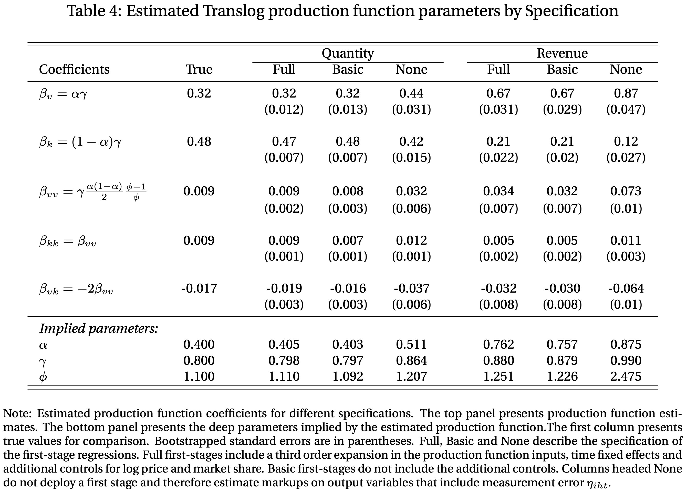
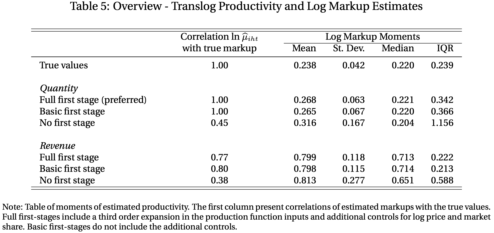
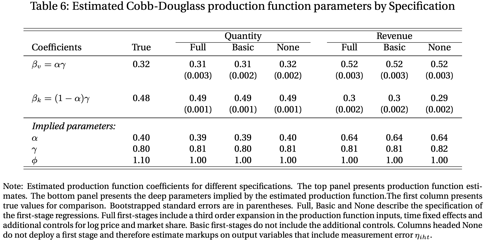
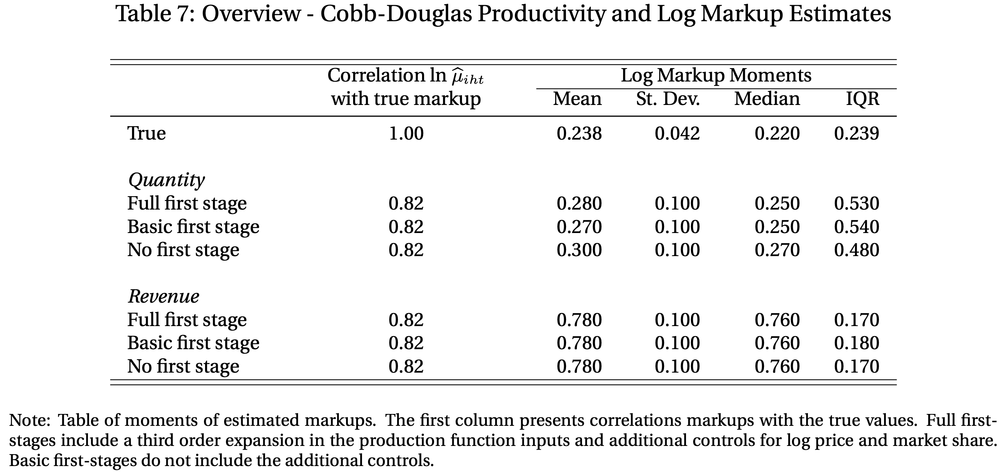
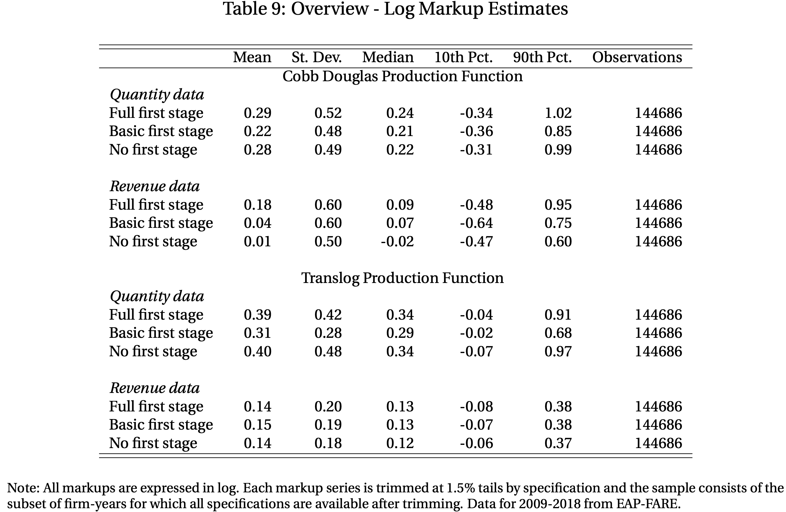
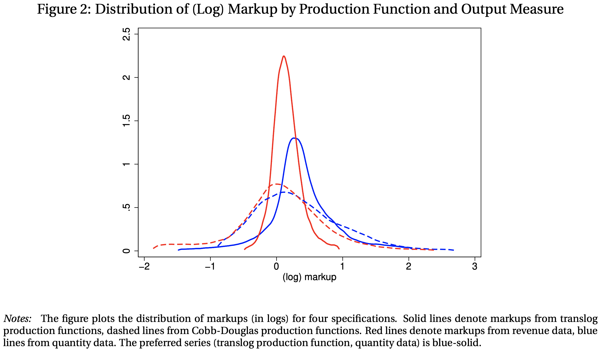
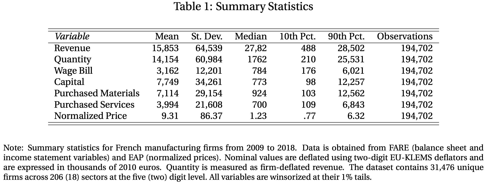
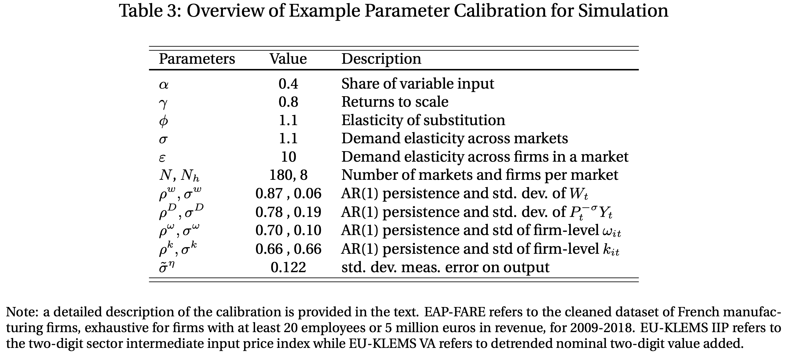

layout: false

```{r setup, include=FALSE}
options(htmltools.dir.version = FALSE)
knitr::opts_chunk$set(
  # fig.width=9, fig.height=3.5, fig.retina=3,
  # out.width = "90%",
  cache = FALSE,
  echo = FALSE,
  message = FALSE, 
  warning = FALSE,
  hiline = TRUE
)
```

```{r xaringan-themer, include=FALSE, warning=FALSE}
library(xaringanthemer)
style_duo_accent(
  primary_color = "#4F2683",
  secondary_color = "#4F2683",
  inverse_header_color = "#FFFFFF",
  base_font_size = "24px",
  title_slide_background_image = "Horizontal_Rev.png",
  title_slide_background_size = "10%, no-repeat",
  title_slide_background_position = "bottom",
  extra_css = list(
  ".small" = list("font-size" = "80%"),
  ".full-width" = list(
    display = "flex",
    width   = "100%",
    flex    = "1 1 auto"
  )
)
)


```


.left-column[

### What's the question?

### Why does it matter?

### What's the contribution?

### How do they do it?

]

--

.right-column[

How big (if any) are the **biases** of our markup estimates due to 
  1. common assumptions (**Cobb-Douglas** production function) and 
  2. data limitations (**Revenue** instead of quantity).

Markups are directly linked to aggregate output and total factor productivity. The levels and dispersion of markups have increased over the last 40 years .small[(De Loecker et al., 2020)].

The authors show that: 
  1. a misspecified production function would estimate **well the level but not the dispersion**, and 
  2. estimates from revenue data would **mismeasure the level**, but they **do well informing about the markup dispersion** (cross-section and overtime).

The authors use simulations from a quantitative model and rich firm-level administrative production and pricing data.

]

---

## Introduction

-  Markups are usually estimated using the Hall (1986,1988) ratio, $\mu=\text{output elasticity of flexible input}\times \frac{\text{Revenue}}{\text{Firm's spending on flexible input}}$. 

<!-- -- -->

- The parameters of the production function (PF) are needed. Usually, the two-stage GMM estimator is employed (Acekerberg et al., 2015)(ACF).

--

- However, there are three main criticisms:
  - **Revenue data**: Estimates of the elasticities for inputs are lower (wrt. production data).
  - **Cobb-Douglas (CD)**: True PF might be more complex.
  - **Market power**: Purging measurement error in first stage is not feasible if researchers can't observe marginal costs (we usually can't). .small[(Bond et al., 2020; Doraszelski and Jaumendreu, 2020)]

---

## Introduction

The authors address these criticism in two ways:

--

.pull-left[

### Simulation

Firms compete oligopolistically and have endogeneously heterogeneous markups and translog (TL) PF.

Comparison between true parameter of the production function and estimates from the ACF procedure and Hall markup ratio-estimator.

]

--

.pull-right[

### Empirics

Comparison of markup estimates of different specifications using **firm-level** data on **French manufacturing** firms with at least 20 employees. 

Data contains balance sheets and income statements between 2009 and 2018, and data on the unit values of the sold products. 

]


---

## Preview of results

--

- The average level of the **revenue-based** markups is **not informative** of the true average markup. However, **markup dispersion**, both in the cross-section and over time, is **estimated reasonably well.**

--

- The **average markup** when a **CD PF** is assumed is **well** estimated when the true PF is TL, but **dispersion is not.** For the French data, the dispersion of markups under CD is **more than twice** in contrast with the estimates of a TL.

--

- The specification of the **first stage has minor effects** on the estimates of the PF and markups.

---

## Analytical framework

<!-- -- -->

- Firms produce output $Y_{it}$ using one input $V_{it}$. Total factor productivity (TFP) shocks in logs, unobserved to the econometrician, $\omega_{it}$. 

<!-- -- -->

- Lower-caps denote log-deviations from the mean, $x_{it}=\log X_{it}- \mathbf E[\log X_{it}]$

<!-- -- -->

- Measurement error is log-additive, $\eta_{it}$.

<!-- -- -->

\begin{equation}
y_{it}=\alpha v_{it} + \omega_{it} + \eta_{it}
\end{equation}

<!-- -- -->

- $v_{it}$ is variable and static (flexible: choice is determined in the period). $\omega_{it}$ is iid across time and firms.

--

- Markups, $\mu_{it}=\alpha (P_{it} Y_{it})/(W_{t}V_{it})$. $P_{it}$ firm's price, $W_{t}$, factor price.

---
name: est

## Two-stage GMM procedure

Assume: $\mathbf E[\hat \eta_{it} v_{it-1}]=0$ and $\mathbf E[\hat\omega_{it} v_{it-1}]=0$.

--

#### GMM estimator (Def. 5)

> The GMM estimator is $\hat \alpha \in \mathbf R$ such that the moment $\mathbf E [(\widehat{\omega_{it}+\eta_{it}})v_{it-1}]$ is equal to zero, where $\widehat{\omega_{it}+\hat{\eta}_{it}}=y_{it}+\hat \alpha v_{it}=(\alpha-\hat\alpha )v_{it}+\omega_{it}+\eta_{it}$.

--

Then, 

\begin{equation}
  \mathbf E \left[ (\hat \omega_{it}+\hat \eta_{it})v_{it-1}\right]=(\alpha-\hat\alpha)\mathbf E[v_{it}v_{it-1}]=0
\end{equation}


The estimator is unbiased, as long as $\mathbf E[v_{it}v_{it-1}]\not=0$. The measurement error only increases the variance of the composite error term $\omega_{it}+\eta_{it}$.

.footnote[[Productivity](#productivity)]

---

## Potential biases

### Revenue versus quantity


\begin{equation}
  r_{it} = y_{it}+p_{it}=\alpha v_{it}+\omega_{it}+p_{it}
\end{equation}

- $r_{it}$, log mean deviation of revenue. $p_{it}$ log mean deviation of price.

--

#### GMM estimator on revenue

> The GMM estimator is $\hat\alpha \in \mathbf R$ such that the moment $\mathbf E [\widehat{tfpr}_{it}v_{it-1}]=0$, where $\widehat{tfpr}_{it}=p_{it}+y_{it}-\hat\alpha v_{it}=(\alpha-\hat\alpha) v_{it}+p_{it}+\omega_{it}$.

--

\begin{equation}
  \hat\alpha =\alpha +\frac{\mathbf E [p_{it}v_{it-1}]}{\mathbf E [v_{it}v_{it-1}]}
\end{equation}

---

## Potential biases

### Cobb-Douglas vs. Translog

\begin{equation}
  y_{it}=\alpha v_{it}+\beta v^2_{it}+\omega_{it}.
\end{equation}

- Assume true PF is TL.

--

#### Misspecified GMM estimator

> The misspecified GMM estimator $\hat\alpha \in \mathbf R$ such that $\mathbf E [\hat\omega^{Mis}_{it}v_{it-1}]=0$, where $\hat\omega^{Mis}_{it}=y_{it}-\hat\alpha v_{it}=(\alpha-\hat\alpha)v_{it}+\beta v^2_{it}+\omega_{it}$.

--

\begin{equation}
  \hat\alpha=\alpha+\beta\frac{\mathbf E[v^2_{it}v_{it}]}{\mathbf E[v_{it}v_{it-1}]}
\end{equation}

---

## Effects on markups

The authors show that:

--

.pull-left[

### Revenue vs. quantity


- Revenue-based markups are **equal** to the true markup up to a **constant.**

- $\mathbf{Var}[\log \hat\mu^R_{it}]=\mathbf{Var}[\log \mu_{it}]$
]

--

.pull-right[

### CD vs. TL

- The average log estimated markup using a misspecified PF is **equal** to the average true markup up to a **Jensen's inequality.**

- The correlation and **variance** of the misspecified markups are **different** from the true ones.

]

---
name: data

## Data

Two main datasets:

- FARE ( _Fichier Approché des Resultats d'Esane_ ): Detailed balance sheet and income statement. Originates from filings to the tax administration (DGFiP).

- EAP ( _Enquête Annuelle de Production_ ): Revenues and quantities that firms ship (proxy for prices). Product-level statistical survey by INSEE (statistical office) covering manufacturing firms with at least 20 employees or revenue in excess of 5 million euros.

.footnote[

[Summary statistics](#table1)

]

---

## Simulation | Model

<!-- -- -->

### Demand 

Double nested CES demand system. $N$ discrete markets.

\begin{equation}
  Y_t=\left[ \sum^N_{h=1} Y_{ht}^{\frac{\sigma-1}{\sigma}} \right]^{\frac{\sigma}{\sigma-1}} ;\quad
  Y_{ht}=\left[ \sum^{N_h}_{h=1} Y_{iht}^{\frac{\varepsilon-1}{\varepsilon}} \right]^{\frac{\varepsilon}{\varepsilon-1}}
\end{equation}

- $h$ indexes markets and $i$ firms. $\sigma$ is the elasticity of substitution (ES) across markets, and $\varepsilon$ ES across firm-level goods within a market. 

- $\varepsilon > \sigma$, easier to substitute across firms than across markets.

---

## Simulation | Model

### Technology

The production function for log output $y_{iht}$ is TL

\begin{equation}
  y_{iht}=\omega_{it}+\gamma\alpha v){iht}+\gamma(1-\alpha)k_{iht}+
  \gamma\frac{\alpha(1-\alpha)(\phi-1)}{2\phi}(v^2_{iht}+k^2_{iht}-2k_{iht}v_{iht})
\end{equation}

- $v_{iht}$ is the log of the variable input, and $k_{iht}$, the log of the fixed input.

- $\omega_{it}$ is the log of (hicks-neutral) total factor productivity, $\gamma$ returns to scale, $\alpha$ the weight of the variable input in the PF, and $\phi$ is the ES between flexible and fixed input.

---
name: cal

## Model | Equilibrium

> Given an exogenous sequence for 
> 1. variable input prices $W_{t}$ (agg. shock),
> 2. aggregate demand $P_t^\sigma Y_t$ (agg. shock),
> 3. productivities $\omega_{iht}$, and
> 4. fixed factors $k_{iht}$
>
> the equilibirum is defined as a sequence of markups $\mu_{iht}$, prices $P_{iht}$, log marginal costs $mc_{iht}$, market shares $s_{iht}$, variable inputs $v_{iht}$ and output $y_{iht}$, and sector price indices $P_{ht}$ such that FOC's of the firms are met, prices are the product of maringal costs, etc... 

--

**Calibration**: 1440 firms, divided into 180 markets, 40 periods. 13 parameters to calibrate.

.small[
[Parameters](#par)
]


---

## Results

- Estimate different specifications using the simulations.

- All specifications assume that variable input is correctly $v_{iht}$.

- Preferred specification: 
  1. quanntity data;
  1. first-stage using log of the price, market shares and a third order expansion of the inputs $v_{it}$ and $k_{it}$;
  1. TLPF 
  
\begin{equation}
  y_{iht}=\beta_v v_{iht}+\beta_k k_{iht} + \beta_{vv} v^2_{iht}+\beta_{kk} k^2_{iht} + \beta_{vk} v_{iht} k_{iht}+\omega_{iht}
\end{equation}

---
format: false

```{r, out.width="80%", fig.align='center'}

```


---



---



---



---

## Take-away

- Revenue-based estimates of the PF elasticities are biased. 

- Accuracy of the PF estimates declines if no first-stage is conducted.

- CD estimates of the markups are similar in terms of average values, but understate the dispersion of the markups.

---

## Empirics

Elasticities of quantities and revenue with different specifications (12 specifications for the 19 industries).

1. Elasticity of revenue wrt materials (ERM) is usually lower than the elasticity of quantity (EQM). EQM is 34% higher on average the ERM.

1. First-stage specification has only modest effects. Minor differences between Full and no first-stage at all.

1. High heterogeneity in the elasticities of output wrt materials (EOM). High EOM: furniture and chemicals. Low EOM: textile and leather.

---

```{r, out.width="80%", fig.align='center'}

```

---


---

# Take-away

- Revenue-based estimates of markups are consistently lower than quantity-based estimates.

- The standard deviation of the estimated markups is significantly higher for the CDPF.

- The functional form of the PF has a greater effect on markup estimates than the first-stage specification.

---

## Conclusions

- The average markup is estimated well under CD, but the dispersion is not.

- In contrast to the quantity-based markup estimates, the revenue-based one miss the level but hit dispersion.

- First-stage specification has modest effects on the markup estimates.


---
class: inverse center middle

# À la prochain!

---
name: productivity

## Productivity

- The difference between $\omega_{it}$ and $\eta_{it}$ is that $\omega$ is observed by the firm, and affects its choice of $v_{it}$.

- The demand for $v_{it}$ is an invertible function in productivity. Then, $\omega=v^{-1}(v_{it},\Xi_{it})$.

- First stage becomes a non-parametric regression:

\begin{equation}
y_{it}=\Phi(v_{it},\Xi_{it})+\eta_{it}
\end{equation}

- Authors use time fixed effects, output prices and market shares (as a proxi for markups) in their estimations.

.footnote[[&#x2B05; Back](#est)]

---
format: false
name: table1



.footnote[[&#x2B05; Back](#data)]

---
name: par



.footnote[[&#x2B05; Back](#cal)]

